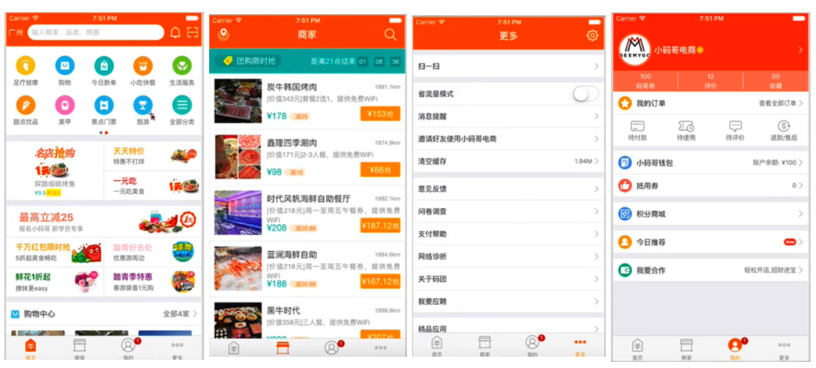
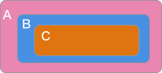
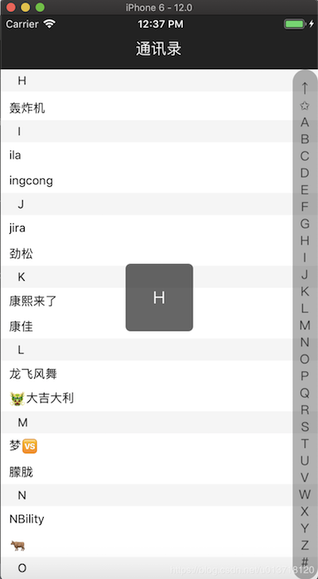
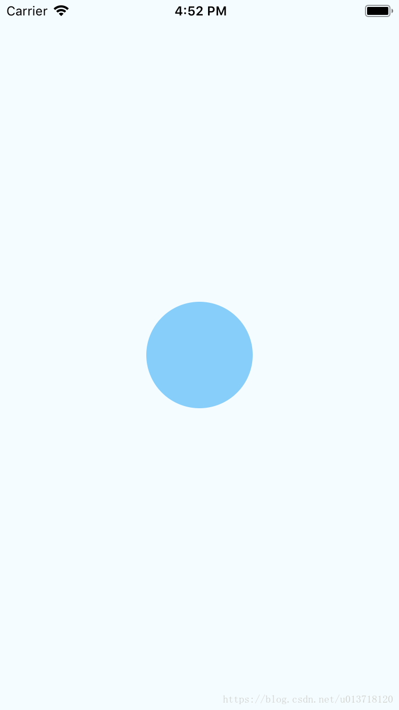
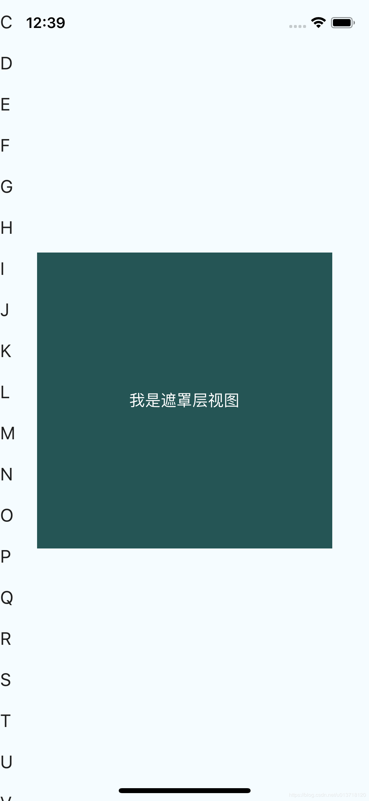

# 一、React Native 介绍


##1、开篇

 Facebook于2015年9月15日发布**React Native**，发展成长至今，它成为原生手机端App必不可少的开发模式之一。目前比较成熟的跨平台方案:

```
1）React Native,  Vue+Weex
2）AppCan
3）Flutter
```
React Native已经完成了对多端的支持，实现了真正意义上的面向配置开发: 开发人员可以只使用JavaScript也能编写原生移动，结合React语法构建组件，实现：**Android, iOS 两端代码的复用**，并发布上线。

 

 React Native产出的并不是**“网页应用”** ， 或者说**“HTML5应用”** ，又或者**“混合应用”** ，而是一个真正的移动应用，从使用感受上和用Objective-C或Java编写的应用相比几乎是无法区分的。


目前电商类App 使用React native 开发模式的还是比较的多


## 2、开发平台选择？

- MacOS系统（推荐）

  >  iOS和Android都全部支持！

- Windows系统和Linux系统

  >  目前只支持Android


## 3、React Native的优势？

- 跨平台开发

  >  运用React Native，我们可以使用同一份业务逻辑核心代码来创建原生应用运行在Android端和iOS端；

- 追求极致的用户体验：

  >  热更新和热部署 

- learn once，write everywhere（最具魅力）

  >  React Native不强求一份原生代码支持多个平台，所以不是“Write once, run anywhere”（Java），而是“Learn once, write anywhere”。

 


## 4、React Native开发注意事项

尽管在移动开发中 , 原生App的开发成本很高, 但是现阶段基于原生开发仍然是必须的, 因为Web的用户体验仍然无法超越native(原生), 主要体现在:

- Native 的原生控件有更好的体验
- Native 有更好的手势识别
- Native 有更好的线程模型, 尽管Web Worker 可以解决一部分问题, 但是像图像解码、文本渲染、仍然无法多线程, 这影响了web的流畅性. 

React Native所需要的技术栈比较多，需要良好的 JavaScript功底，最好还需要懂一些iOS和Android原生开发，才能很好驾驭中大型移动端跨平台项目。初学者使用RN开发项目，建议选择：
- 功能适中，交互一般，不需要特别多的系统原生支持
- 对于部分复杂的应用，可以考虑原生+React Native混合开发


#二、React Native环境搭建


> 如果在安装React Native时发现安装出现任何问题, 这时很有可能是因为你的开发环境出现了问题, 这时最好的方案就是参考下文档, 查看一下一般就能解决问题.
>
> 中文文档地址 Https://reactnative.cn


##1、Mac OS系统 (RN环境搭建)

###1、安装前注意：

- 在Max OS X 系统中，homebrew在安装软件时可能会碰到 `/usr/local`目录不可写的权限问题。可以使用下面的命令修复：

  ```
  // 使用下面这个命令修改 目录权限
  sudo chown -R `whoami` /usr/local
  // 也可以使用其它权限, 修改
  ```

- 如果命令行提示`command not found`，请加上sudo获得最高权限  


### 2、环境需求 

- 安装Homebrew

  >  Homebrew是OS X的套件(包)管理器，用于安装Node.js和一些其他必须的工具软件。

  - 安装命令

    ```
    /usr/bin/ruby -e "$(curl -fsSL https://raw.githubusercontent.com/Homebrew/install/master/install)"
    ```

-  安装npm 和 Node.js

  >  node.js最好安装最新版本，node安装成功后npm自动也就有了，直接下载安装Node.js，网址：https://nodejs.org/en/download/ ，可以以软件形式安装，或者命令行形式安装：

  ```
  brew install node
  ```

- 安装WatchMan

  >  WatchMan是由Facebook提供的监视文件系统变更的工具。安装此工具可以提高开发时的性能（packager可以快速捕捉文件的变化从而实现实时刷新）。

  ```
  brew install watchman
  ```

  - 验证是否安装成功

   


### 3、React Native安装

- **react - native 安装文档地址**: https://reactnative.cn/docs/getting-started.html

  在安装或者运行程序是如果有任何问题, 第一时间查看文档

- Yarn、React Native的命令行工具（react-native-cli）

  >  Yarn是Facebook提供的替代npm的工具，可以加速node模块的下载。
  >
  > React Native的命令行工具用于执行 `创建、初始化、更新项目、运行打包服务（packager）`等任务。 

- 查看是否安装成功

  > 全局node_moudules中查看

    

   

### 4、Xcode安装

React Native 目前需要Xcode 10 或更高版本。我们可以通过 App Store 或是到Apple 开发者官网上下载。安装完Xcode会同时安装 Xcode IDE、Xcode 的命令行工具和 iOS 模拟器。

> 如果使用的不是 Xcode 10 , 使用命令 `react-native init app ` 创建项目后, 在运行Xcode项目时可能报错. 
>
> 可使用下面的命令创建更低版本的 react native 工程项目

```
// 创建指定版本的RN工程项目
npx react-native init MyApp --version 0.44.3
```


####1、iOS 模拟器调试技巧

> 补充:
>
> 在安装完成 React native 后使用命令 `react-native init MyApp` 就可以创建一个React native项目, 里面包含了`iOS`  和 `android` 工程, 可以单独使用Xcode 或者 android Studio 打开对应的工程项目运行在模拟器上调试, 也可以直接使用终端命令直接打开对应的模拟器(不需要直接使用Xcode 和 android studio)这也是前端开发RN的常用做法. 
>
> 这里要提一下, 当我们运行了模拟器,并修改了代码后选择iOS模拟器直接使用快捷键 `command + R` 就可刷新模拟器页面, 但是因为电脑软件键快捷键冲突的问题, 有时这个快捷键可能不好用, 这时我们就可以使用另外的方式 `command + control + Z` 调出iOS模拟器的调试菜单, 手动刷新即可. 

### 5、JDK 和 Android Studio


#### 1、安装最新版的JDK

在命令行中输入``` javac -version```来查看你当前安装的JDK版本。

下载安装地址：http://www.oracle.com/technetwork/java/javase/downloads/jdk8-downloads-2133151.html （资料中已经存放）


#### 2、安装Android studio

在安装过程中请严格执行以下选项：

- 1、选择 Custom 选项

   

  

- 2、勾选`Performance`和`Android Virtual Device`

    


- 3、安装完成后，在Android Studio的启动欢迎界面中选择 `Configure | SDK Manager` 

   

- 4、在`SDK Platforms`窗口中，选择`Show Package Details`，然后在`Android 9.0 (Pie)`中勾选下图所示并安装。

   

  

     

- 5、在`SDK Tools`窗口中，选择`Show Package Details`，然后在`Android SDK Build Tools`中勾选`Android SDK Build-Tools 28.0.3`（必须有这个版本）。

   

- 6、ANDROID_HOME环境变量

  React Native 需要通过环境变量来了解你系统中的 Android SDK 装在什么路径，从而正常进行编译。具体的做法是把下面的命令加入到~/.bash_profile文件中，使用  vi ~/.bash_profile。

  ```
  # 如果你不是通过Android Studio安装的sdk，则其路径可能不同，请自行确定清楚。
  export ANDROID_HOME=$HOME/Library/Android/sdk
  export PATH=$PATH:$ANDROID_HOME/tools
  export PATH=$PATH:$ANDROID_HOME/tools/bin
  export PATH=$PATH:$ANDROID_HOME/platform-tools
  export PATH=$PATH:$ANDROID_HOME/emulator
  ```


### 6、安装Genymotion

Genymotion是一个第三方模拟器，它比Google官方的模拟器更易设置且性能更好。

但是，它只针对个人用户免费(可能需要VPN)。

- 下载并安装Genymotion(https://www.genymotion.com/)
- 打开Genymotion,如果你尚未安装VirtualBox,它有可能会提示你安装
- 创建一个模拟器并启动
- 按下`⌘+M` 可以打开开发者菜单(在安装并启动了React Native应用之后)

###### 3）Gradle Daemon
开启Gradle Daemon可以极大地提升java代码的增量编译速度。


##2、Windows系统(RN环境搭建)


**确保所有的命令行操作都在管理员权限下操作** 


### 1、需要安装的插件


####1、Chocolatey

Chocolatey是一个Windows上的包管理器，类似于Mac上的watchMan。一般的安装步骤应该是下面这样, 如果国内访问失败, 请使用翻墙工具:


#### 2、Python 2

```
choco install python2
```


#### 3、Node

```
choco install nodejs.install
```
打开命令提示符窗口，使用Chocolatey来安装NodeJS，或者通过软件安装。安装完node后建议设置npm镜像以加速后面的过程（或使用科学上网工具）。

```
 npm config set registry https://registry.npm.taobao.org --globalnpm
 npm config set disturl https://npm.taobao.org/dist --global
```


### 2、创建并运行React Native项目


####1、React Native的第一个应用

- 执行命令,生成一个工程

  ```
  react-native init 项目名称
  ```

  >  注意:
  >
  > 由于众所周知的网络原因，需要等待一段时间（具体视网络情况而定）。react-native命令行从npm官方源拖代码时会遇上麻烦，可以将npm仓库源替换为国内镜像：

  ```
  npm config set registry https://registry.npm.taobao.org
  npm config set disturl https://npm.taobao.org/dist
  ```

  - 运行截图

     

    

- 运行工程文件

  > 不管是 iOS 还是 Android，在开发调试阶段，都需要在 Mac 上启动一个 HTTP 服务，称为`Debug Server`，默认运行在`8081`端口，APP 通 `Debug Server `加载 js。

   

  - 客户端运行界面

      

    

- 把React Native创建的应用跑在Android上
  - 命令行执行cd MyRNDemo,路径切换到项目主目录
  - 命令行执行react-native run-android进行加载运行android 应用。
  - 使用编辑器进行打开和修改index.android.js文件，接着通过菜单按钮选择Reload JS来进行刷新修改


## 3、管理React Native库的版本


在开发中，会经常的去控制React Native的版本库，得以适配各种条件下的开发，那该如何查看、控制ReactNative的版本呢？


###1、查看本地的React Native版本

- 命令行输入:

  ```
  // 查看当前 react-native-cli 的版本 
  react-native --version
  ```

  > 如果上面的命令在react-native 的工程目录下执行,  还会显示当前创建的react-native 的项目版本信息
  >
  > 我们在使用react-native-cli 脚手架创建react-native 项目时, 可以创建具体版本的 react-native 工程, 命令如下:
  >
  > ```
  > npx react-native init MyApp --version 0.44.3
  > ```

- 命令行效果:

   

  

###2、 更新本地的React Native版本

- 命令行输入:

  ```
  // -g 表示全局更新
  npm update -g react-native-cli
  ```


###3、查询react-native的npm包最新版本

NPM的全称是 `Node Package Manager `，是一个NodeJS包管理和分发工具，已经成为了非官方的发布Node模块（包）的标准。

- npm包地址 ：

  ```
  https://www.npmjs.com/package/react-native
  ```

- 命令行查询： 

  ```
  npm info react-native
  ```

  - 查询效果：
      


- 升级或者降级 npm 包的版本

  > 是这样的哈, 因为软件是一直在开发迭代的, 我们的工程项目的依赖环境可能在变化,  有时我们有特定的需求想要使用指定版本的npm包, 而不是最新的,这时我们可以使用下面的命令:
  >
  > 不过, 一般npm 包是向下兼容的.

  ```
  npm install --save react-native@0.18
  ```

  


## 4 webStorm 设置 React Native代码提示


是这样的哈, 因为React Native 刚出来, webStorm 还没有代码提示, 这样的话我们在使用webStorm 开发RN的时候就不方便, 所以我们可以通过安装插件的方式来解决这个问题:

- 从github 上 下载 xml 插件

  > 在github 上搜索 ReactNative-LiveTemplate, 在 github 上可以看到具体的用法说明

  ```
  git clone https://github.com/virtoolswebplayer/ReactNative-LiveTemplate
  ```

- 安装

  Mac下安装

  > 提示：如果没有`templates` 文件夹，你可以手动创建一个

  - webstorm11安装路径

    将`ReactNative.xml`复制到 `~/Library/Preferences/WebStorm11/templates`

  

  - webstorm2016.2安装路径

    将`ReactNative.xml`复制到 `~/Library/Preferences/WebStorm2016.2/templates`

  

  - webstorm2017.1安装路径

    将`ReactNative.xml`复制到 `~/Library/Preferences/WebStorm2017.1/templates`

  

  - webstorm2017.2安装路径

    将`ReactNative.xml`复制到 `~/Library/Preferences/WebStorm2017.2/templates`

  重启 WebStorm

  

- 使用方法

  - 通用方法

    直接输入 `组件` 或 `Api` 名称的`首字母`，比如想要 `View`，只要输入 `V` 自动提示代码里就会看到 `View`

  - StyleSheet属性提示

    首先按下 `command + J`，然后输入属性名的 `首字母`

    如：输入 `f`，会自动提示 fontSize, fontFamily, fontStyle...等等


#三、React Native工程启动流程


## 1、工程结构分析


###1、创建React Native工程项目

```
// 创建一个react native 工程项目, LKDemo2是项目名称
react-native init LKDemo2
```


##2、运行React Native程序

- 运行iOS模拟器

  ```
  // 切换到 rn 工程目录
  cd /Users/yang/Desktop/rn_demo/demo08
  
  // 运行 iOS 程序模拟器
  npx react-native run-ios
  ```

- 运行android 程序

  ```
  // 切换到 rn 工程目录
  cd /Users/yang/Desktop/rn_demo/demo08
  
  // 运行 android 程序模拟器
  npx react-native run-android
  ```

  


### 2、工程目录结构图

 


###3、工程启动流程分析 

> (此处一iOS为例分析)


####1、index.js文件

- iOS工程或安卓工程一启动，就会加载目录中```index.js```文件，通过```AppRegistry```去注册组件，并且把注册完成的组件输出给iOS端或Android端：

  ```
  // 引入注册组件模块
  import {AppRegistry} from 'react-native';
  // 引入组件汇总模块
  import App from './App';
  // 引入输出组件名称
  import {name as appName} from './app.json';
  
  // 注册组件，程序主入口
  // appName: 注册模块名称
  // () => App: 组件类，程序启动会自动加载该类实例化的组件对象
  AppRegistry.registerComponent(appName, () => App);
  ```

####2、AppDelegate.m 文件

- 通过Xcode打开iOS工程，或者Android Studio打开Android工程，此处以iOS端为例子。找到AppDelegate.m文件，查看客户端加载方法：

    


- 代理文件中通过该方法加载JS端输出的模块，注意模块的名称两端必须保持一致：

```
initWithBridge:bridge moduleName:@"MyRNDemo" initialProperties:nil
```

- 代理文件解析加载注释如下

```
- (BOOL)application:(UIApplication *)application didFinishLaunchingWithOptions:(NSDictionary *)launchOptions
{
  // 1. 获取桥接文件
  RCTBridge *bridge = [[RCTBridge alloc] initWithDelegate:self launchOptions:launchOptions];
  // 2. 根据模块加载根视图
  RCTRootView *rootView = [[RCTRootView alloc] initWithBridge:bridge
                                                   moduleName:@"MyRNDemo"
                                            initialProperties:nil];

  rootView.backgroundColor = [[UIColor alloc] initWithRed:1.0f green:1.0f blue:1.0f alpha:1];

  // 3. 设置窗口
  self.window = [[UIWindow alloc] initWithFrame:[UIScreen mainScreen].bounds];
  
  // 4. 设置窗口根控制器的view
  UIViewController *rootViewController = [UIViewController new];
  rootViewController.view = rootView;
  self.window.rootViewController = rootViewController;
  
  // 5. 显示窗口
  [self.window makeKeyAndVisible];
  return YES;
}
```

####3、App.js文件

- App.js文件运行步骤
  - 加载React模块，使用其内部的API，比如：jsx语法；
  - 加载React Native原生组件，比如：`SafeAreaView, StyleSheet, View, Text,Image`等；
  - 自定义组件类，作为模块的输出；
  - 创建样式对象，传入样式对象，根据样式中的对象描述，创建样式表
  - 导出当前模块
```
/**
 * 撩课学院
 * https://itlike.com
 */

// 1. 加载React模块
import React from 'react';

// 2. 加载原生组件
import {
  SafeAreaView,
  StyleSheet,
  View,
  Text,
  StatusBar,
  Image
} from 'react-native';


// 3. 自定义组件（程序入口组件）
const App: () => React$Node = () => {
  return (
    <>
      <StatusBar barStyle="dark-content" />
      <SafeAreaView style={styles.safeView}>
         <View style={styles.viewStyle}>
           <Image
               style={{width: 168, height: 168}}
               source={{uri: 'http://www.itlike.com/template/simple/res/404/img/xiaoliao.png'}}
           />
           <Text style={styles.textStyle}>小撩陪你开启RN学习之旅！</Text>
         </View>
      </SafeAreaView>
    </>
  );
};

// 4. 创建样式对象
// 传入样式对象，根据样式中的对象描述，创建样式表
const styles = StyleSheet.create({
  safeView: {
    flex: 1
  },
  viewStyle: {
    display: 'flex',
    flex: 1,
    justifyContent:'center',
    alignItems: 'center'
  },
  textStyle: {
    fontSize: 20
  }
});

// 5. 导出当前模块
export default App;
```


## 3、语法分析


### 1、JSX语法

JSX语法是一个比较高级但很直观的JS语法糖。我们在创建View的结构时，可以用类似HTML标签的形式创建，当然最终在编译时还是会转换成JS代码。
- 函数中只要返回`组件` ，都需要用`()` 包裹 

  ```
  const App : () => React$Node = () => {
    return (
        <View></View>
    );
  };
  ```

  

- 函数中除字符串以外，赋值时都需要用`{}`包裹 

  ```
   <SafeAreaView style={styles.safeView}> </SafeAreaView>
  ```

  ```
   <Image style={{width: 168, height: 168}} 
   				source={{uri: 'http://www.itlike.com/template/simple/res/404/img/xiaoliao.png'}}
   />
  ```

- 组件内使用变量时，都需要用大括号包裹，否则会被当成普通字符串处理。

  ```
  const str = '引擎计划';
  <Text>{str}</Text>
  ```

  

###2、样式对象文件

内部以键值对的形式，取值如同JS中的对象调用。
```
const styles = StyleSheet.create({
  viewStyle: {
    display: 'flex',
    flex: 1,
    justifyContent:'center',
    alignItems: 'center'
  }
});  
```

 


#四、React Native Flex布局

在以前,界面的搭建都是采用CSS的布局, 基于**盒子模型** , 依赖**display属性**, **position属性** , **float属性** . 但对于那些特殊布局非常不方便, 比如: `垂直居中`


一种全新的针对web和移动开发布局应运而生: **Flex布局** , 可以简便、完整、响应式的实现各种页面布局. 目前, 它已经得到了所有浏览器的支持, 这意味着, 现在就能很安全的使用这项功能. 


##1、FlexBox布局介绍


### 1、FlexBox是什么意思呢？

- flexible（形容词）：能够伸缩或者很容易变化，以适应外界条件的变化

- box（名词）：通用的矩形容器

  > 一句话, FlexBox 就是弹性盒子的意思

  

### 2、 什么是FlexBox布局?

弹性盒模型（`The Flexible Box Module` ）,又叫Flexbox，意为“弹性布局”，旨在通过弹性的方式来**对齐** 和 **分布** 容器中内容的**空间** ，使其能适应不同屏幕，为盒装模型提供最大的灵活性。

Flex布局主要思想是：**让容器有能力让其子项目能够改变其宽度、高度（甚至是顺序），以最佳方式填充可用空间；** 

>  **React native 中的FlexBox是这个规范的一个 子集**。 
>
> 也就是说 react Native 中的Flexbox 和 网页中的Flexbox 是有一点差异的


### 3、大部分情况下是处理图中FlexItem在FlexContainer中的位置和尺寸关系

 


## 2、Flexbox开发中应用场景


### 1、Flexbox在布局中能够解决什么问题

- 浮动布局 -- `问题`

- 各种机型屏幕的适配-- `问题`

- 水平和垂直居中-- `问题`

- 自动分配宽度-- `问题`

- ......`问题`

  


###2、flex-flow流

在CSS中，常规的布局是基于块和内联流方向，而Flex布局是基于flex-flow流

>  下图很好解释了Flex布局的思想：

 

容器默认存在两根轴：**水平的主轴（main axis）**和**垂直的交叉轴又称侧轴（cross axis）**。

主轴的开始位置（与边框的交叉点）叫做main start，结束位置叫做main end；

交叉轴的开始位置叫做cross start，结束位置叫做cross end。

项目Item默认沿主轴排列，单个项目占据的主轴空间叫做main size(主轴尺寸)，占据的交叉轴空间叫做cross size(侧轴尺寸)。


###3、主轴 侧轴

根据伸缩项目排列方式的不同，主轴和侧轴方向也有所变化：

 


## 3、Flexbox的常用属性


### 1、 容器属性

容器属性主要有以下几个:

`flexDirection`  `justfyContent`  `alignItems`  `flexWrap` 


#### 1、 flexDirection

-  flexDirection: `row | row-reverse | column | column-reverse` 

  >  该属性决定主轴的方向（即项目的排列方向）。常用的取值如下: 

  - row：主轴为水平方向，起点在左端。
  - column(默认值)：主轴为垂直方向，起点在上沿。
  - row-reverse：主轴为水平方向，起点在右端。 `移动端 不常用 ` 
  - column-reverse：主轴为垂直方向，起点在下沿。`移动端 不常用 ` 


 

#### 2、justifyContent

- justifyContent:`flex-start | flex-end | center | space-between | space-around`
  >  定义了伸缩项目Item在主轴线的对齐方式 

  - flex-start(默认值)：伸缩项目向一行的起始位置靠齐。
  - flex-end：伸缩项目向一行的结束位置靠齐。
  - center：伸缩项目向一行的中间位置靠齐。
  - space-between：两端对齐，项目之间的间隔都相等。
  - space-around：伸缩项目会平均地分布在行里，两端保留一半的空间。

    


####3、alignItems

- alignItems:  `flex-start | flex-end | center | baseline | stretch`

  >  定义项目在交叉轴上如何对齐，可以把其想像成侧轴（垂直于主轴）的“对齐方式”。

  - flex-start：交叉轴的起点对齐。
  - flex-end：交叉轴的终点对齐 。
  - center：交叉轴的中点对齐。
  - baseline：项目的第一行文字的基线对齐。
  - stretch（默认值）：如果项目未设置高度或设为auto，将占满整个容器的高度。

   


####4、flexWrap

- flexWrap: `nowrap | wrap | wrap-reverse`

  >  默认情况下，项目都排在一条线（又称"轴线"）上。
  >
  > flex-wrap属性定义，如果一条轴线排不下，如何换行。

   

  - nowrap(默认值)：不换行。

    
  

  - wrap：换行，第一行在上方。 

   
  

  - wrap-reverse：换行，第一行在下方。（和wrap相反）


###2、item元素属性

item 属性主要有以下几个: 

`flex` `alignSelf` 


#### 1、flex

- flex: “flex-grow”、“flex-shrink”和“flex-basis”三个属性的缩写， 其中第二个和第三个参数（flex-shrink、flex-basis）是可选参数。也就是说flex 其实是一个复合属性, 一共有3个参数, 一般情况下后2个参数省略了

  >  默认值为“0 1 auto”。

   宽度 ＝ 弹性宽度 * ( flexGrow / sum( flexGorw ) )

  


#### 2、alignSelf

- alignSelf:  “auto | flex-start | flex-end | center | baseline | stretch”

align-self属性允许单个项目有与其他项目不一样的对齐方式，可覆盖align-items属性。

> 默认值为auto，表示继承父元素的align-items属性，如果没有父元素，则等同于stretch。
>
> alignSelf 元素属性相对于容器属性中的 alignItems 属性, 工程差不多, 一个作用于容器, 

 


## 4、屏幕分辩率

- 在React-native 中获取屏幕的分辨率

  ```
  var Dimensions = require('Dimensions');
  var {width, height, scale} = Dimensions.get('window')
  ```

  


- 获取当前屏幕的宽度、高度、分辨率

  ```
  const App: () => React$Node = () => {
      return (
          <>
              <StatusBar barStyle="dark-content"/>
              <SafeAreaView style={{flex: 1}}>
                  <View style={{flex: 1, backgroundColor: 'red'}}>
                     <Text>
                       当前屏幕的宽度：{Dimensions.get('window').width + '\n'}
                       当前屏幕的高度：{Dimensions.get('window').height + '\n'}
                       当前屏幕的分辨率：{Dimensions.get('window').scale + '\n'}
                     </Text>
                  </View>
              </SafeAreaView>
          </>
      );
  };
  ```

  


#五、React Native常用的组件-上

> 说明:
>
> - 在React native 中使用的长度单位是pt, 但是我们在表示长度时, 直接使用数字即可, 不用带单位
> - 在React Native 中不能使用百分比表示长度


## 1、 View组件

React Native组件View，其作用等同于iOS中的`UIView`,  Android中的`android.view` ，或是网页中的`<div>`标签，**它是所有页面组件的父组件。**

>  使用方式无差异化，基本用于容器使用。

- 常用的属性

  - `Flexbox`:  弹性布局
  - `transforms`: 动画属性
  - `backfaceVisibility`: enum('visible', 'hidden') 定义界面翻转的时候是否可见
  - `backgroundColor`: ,定义元素的背景色, 'red` , 'purple' , '#fff' 
  - `borderBottomColor`: 定义底边框颜色
  - `borderBottomLeftRadius`: 定义左下角圆角
  - `borderBottomWidth`: 定义底部边框的宽度
  - `borderColor`: 边框颜色
  - `borderLeftColor`:左边框颜色
  - `borderRadius`: 
  - `borderRightColor`:
  - `borderStyle`: enum('solid', 'dotted', 'dashed')
  - `opacity`: 设置透明度, 取值 0~1
  - `overflow`: enum('visible', 'hidden'), 设置内容超出容器部分是否显示
  - `elevation`: 高度, 设置Z轴, 可产生立体效果

  ```
  const App: () => React$Node = () => {
      return (
          <SafeAreaView style={{flex: 1}}>
            <View style={{flex: 1, backgroundColor: 'cyan'}}>
              <View style={styles.view1}>
                <Text style={{color: '#fff', fontSize: 18}}>内容区域</Text>
              </View>
            </View>
          </SafeAreaView>
      );
  };
  
  const styles = StyleSheet.create({
    view1: {
      width: 150,
      height: 200,
      backgroundColor:'purple',
      marginLeft: 100,
      marginTop: 100,
      padding: 30
    }
  });
  ```

  


## 2、Text组件

一个用于显示文本的ReactNative组件，和Android中的`TextView`组件或者OC中的`UILabel`组件相类似，专门用来显示基本的文本信息；

>  除了基本的显示布局之外，可以进行嵌套显示，设置样式，以及可以做事件(例如:点击)处理。

- 常用属性
  - `color` 字体颜色
  -  `numberOfLines` (number) 进行设置Text显示文本的行数，如果显示的内容超过了行数，默认其他多余的信息就不会显示了
  - `ellipsizeMode` 这个属性通常和下面的 numberOfLines 属性配合使用，表示当 Text 组件无法全部显示需要显示的字符串时如何用省略号进行修饰。取值：enum('head', 'middle', 'tail', 'clip')
  - `onPress` (fcuntion)  该方法当文本发生点击的时候调用该方法
  - `fontFamily`  字体名称
  - `fontSize`  字体大小
  - `fontStyle`   字体风格(normal,italic)
  - `fontWeight ` 字体粗细权重("normal", 'bold', '100', '200', '300', '400', '500', '600', '700', '800', '900')
  - `textShadowOffset`  设置阴影效果{width: number, height: number}
  - `textShadowRadius`  阴影效果圆角
  - `textShadowColor`  阴影效果的颜色
  - `letterSpacing`  字符间距
  - `lineHeight`  行高
  - `textAlign`   文本对其方式("auto", 'left', 'right', 'center', 'justify')
  - `textDecorationLine`  横线位置 ("none", 'underline', 'line-through', 'underline line-through')
  - `textDecorationStyle` 线的风格("solid", 'double', 'dotted', 'dashed')
  -  `textDecorationColor` 线的颜色
  - `writingDirection` 文本方向("auto", 'ltr', 'rtl')


- 课程代码
```
import React, { Component } from 'react';
import { Text, StyleSheet, View } from 'react-native';

export default class LKText extends Component {
    constructor(props) {
        super(props);
        this.state = {
            titleText: '撩课学院',
            subText: '喜欢IT,就上撩课！',
            bodyText: '对酒当歌，人生几何！对酒当歌，人生几何！对酒当歌，人生几何！'
        };
    }

    render() {
        return (
            <>
                <Text style={styles.baseText}>
                    <Text style={styles.titleText}>
                        {this.state.titleText}{'\n'}
                    </Text>
                    <Text>
                        {this.state.subText}
                    </Text>
                </Text>
                <View style={{backgroundColor:'red', width: 300, height: 200}}>
                    <Text
                        style={{fontSize: 20, lineHeight: 40}}
                        numberOfLines={4}
                        ellipsizeMode='middle'
                    >
                        {this.state.bodyText}
                    </Text>
                </View>
            </>
        );
    }
}

const styles = StyleSheet.create({
    baseText: {
        fontFamily: 'Cochin',
        fontSize: 30
    },
    titleText: {
        fontSize: 40,
        fontWeight: 'bold',
    },
});
```


## 3、Image组件

在开发中还有一个非常重要的组件Image，通过这个组件可以展示各种各样的图片，而且在React Native中该组件可以通过多种方式加载图片资源。包括网络图片、静态资源、临时的本地图片、以及本地磁盘上的图片（如相册）等。


### 1、Image组件三种加载方式

```
 render() {
        return (
            <View>
                {/*本地加载*/}
                <Image
                    source={require('./images/bit.jpeg')}
                    style={{width: 200, height: 200}}
                />
                {/*网络加载*/}
                <Image
                    style={{width: 168, height: 168}}
                    source={{uri: 'http://www.itlike.com/template/simple/res/404/img/xiaoliao.png'}}
                />
                {/*base64加载*/}
                <Image
                    style={{width: 66, height: 58}}
                    source={{uri: 'data:image/png;base64,iVBORw0KGgoAAAANSUhEUgAAADMAAAAzCAYAAAA6oTAqAAAAEXRFWHRTb2Z0d2FyZQBwbmdjcnVzaEB1SfMAAABQSURBVGje7dSxCQBACARB+2/ab8BEeQNhFi6WSYzYLYudDQYGBgYGBgYGBgYGBgYGBgZmcvDqYGBgmhivGQYGBgYGBgYGBgYGBgYGBgbmQw+P/eMrC5UTVAAAAABJRU5ErkJggg=='}}
                />
            </View>
        );
    }
```


###2、设置Image组件的显示模式

- resizeMode，常用取值有：`center、repeat、contain、cover、stretch`。

```
render() {
        return (
            <View>
                <Image
                    style={{width: 400, height: 300, resizeMode: 'stretch', backgroundColor:'red'}}
                    source={{uri: 'http://www.itlike.com/template/simple/res/404/img/xiaoliao.png'}}
                />
            </View>
        );
    }
```


##4、ImageBackground组件

- 设置背景图片-ImageBackground组件
```
 render() {
        return (
            <View>
                <ImageBackground
                    source={require('./images/lk.jpg')}
                    style={{width: 400, height: 200}}
                >
                    <Image
                        style={{width: 168, height: 168}}
                        source={{uri: 'http://www.itlike.com/template/simple/res/404/img/xiaoliao.png'}}
                    />
                    <Text style={{color:'#fff'}}>我是小撩同学！</Text>
                </ImageBackground>
            </View>
        );
    }
```


##5、Image组件的小练习

通过一款包包的展示，总结前面所学的View，Text和今天的Image组件，具体效果如下:

 

核心代码：
```
_renderItem() {
        // 1. 组件数组
        let itemArr = [];
        // 2. 遍历数据数组
        for (let i = 0; i < dataArr.length; i++) {
            // 2.1 取出单个数据
            let data = dataArr[i];
            // 2.2 根据数据创建组件装入组件数组
            itemArr.push(
                <View key={i} style={styles.itemViewStyle}>
                    <Image source={{uri: data.icon}} style={{width:80, height:80}}/>
                    <Text>{data.name}</Text>
                </View>
            )
        }
        // 3. 返回数组
        return itemArr;

    }
```


#六、React Native常用的组件-中


## 1、TextInput 组件

文本输入框，相当于OC中的`UITextField`，在用法和属性方面，两者都有很大的借鉴之处：通过键盘将文本输入到应用程序的一个基本的组件。

本组件的属性提供了多种特性的配置，譬如: 自动完成、自动大小写、占位文字，以及多种不同的键盘类型（如纯数字键盘）等等。


- 常用属性

  - `value`:  字符串型 , 文本输入的默认值

  - `onChangeText`:  函数,    监听输入框中输入的值

  - `keyboardType`:   键盘类型, 决定弹出何种软键盘类型，譬如: `numeric`。

    > - **所有平台都可用** ：
    >
    >   `default`  `number-pad` `decimal-pad` `numeric`  `email-address` `phone-pad` 
    >
    > - **仅iOS可用** ：
    >
    >   `ascii-capable`  `numbers-and-punctuation`  `url`  `name-phone-pad`  `twitter`  `web-search` 

  -  `multiline`:   布尔型, 如果值为真，文本输入可以输入多行。默认值为假。

  - `placeholder`: 字符串型, 在文本输入之前字符串将被呈现出来，通常被称为占位文字

  - `placeholderTextColor`:  字符串型, 占位符字符串的文本颜色
  - `autoCapitalize`: 控制TextInput是否要自动将特定字符切换为大写，取值：`characters`所有字符，`words`每一个单词的首字母, `sentences` 每个句子的首字母（默认情况下),`none` 不会自动使用任何东西
  - `clearButtonMode`: enum('never', 'while-editing', 'unless-editing', 'always'), 清除按钮出现在文本视图右侧的时机，仅在单行模式下可用

  - `editable`:  布尔型, 如果值为假，文本是不可编辑的。默认值为真。
  - `onBlur`:  函数,当文本框失去焦点的时候调用此回调函数
  - `onChangeText`: 函数, 当文本输入的文本发生变化时，调用回调函数

  - `onFocus`: 函数, 当输入的文本是聚焦状态时，调用回调函数

  - `returnKeyType`: enum('default', 'go', 'google', 'join', 'next', 'route', 'search', 'send', 'yahoo', 'done', 'emergency-call'), 决定返回键的样式


## 2、Touchable系列组件

我们发现在前面我们学习到到的: `View` `Image` `Text` `TextInput` 组件 不会对用户的点击、触摸 、拖拽做出合适的响应, 这是十分不友好的. 那么, 在React Native 中, 如何让视图对触发做出合适的响应呢? 

###1、高亮触摸  TouchableHighlight

 当手指点击按下的时候，该视图的不透明度会进行降低同时会看到相应的颜色，其实现原理则是在底层新添加了一个View。

其实,TouchableHighlight也是一个组件, 通过这样一个组件包装以后, 就立马有了相应事件的能力了. 


>  此外，TouchableHighlight只能进行一层嵌套，不能多层嵌套。

- 常用属性：

  - `activeOpacity`:  number , 设置组件在进行触摸的时候，显示的不透明度(取值在0-1之间)

  - `onHideUnderlay`  function  方法, 当底层被隐藏的时候调用

  - `onShowUnderlay`  function 方法, 当底层显示的时候调用
  - `style`: 可以设置控件的风格演示，该风格演示可以参考View组件的style

  - `underlayColor `: 当触摸或者点击控件的时候显示出的颜色


###2、不透明触摸  TouchableOpacity(常用)(有坑)

该组件封装了响应触摸事件, 当点击按下的时候，该组件的透明度会降低。

>  在React native 中实现点击事件, 我们一般会使用 `TouchableOpacity` 组件直接包裹其它要显示的组件, 然后给`TouchableOpacity` 组件添加对应的点击事件(绑定对应的事件方法), 这样当用户点击在`TouchableOpacity` 组件上时就会触发对应的事件,  在react native 中事件处理一般都采用这种方式, 不会使用 Button 组件, 因为iOS和安卓有兼容性问题. 

我们在React Native 开发中经常用到:`点击` `按下` `抬起` `长按等` 触发事件, 那么在**TouchableOpcity** 中又是如何展示呢? 

- TouchableOpacity 组件常用属性(只有一个activeOpacity)：

  - `activeOpacity`  number  , 取值0~1, 用来设置当用户触摸的时候组件的透明度.

  - 代码实操

    ```
    
    class TouchableOpacityDemo extends Component{
      render() {
        return (
            <View>
              <TouchableOpacity
              style={{width: 100, height: 60, backgroundColor:'red'}}
              activeOpacity={0.5}
              {/*onPress={this.myOnPress()} 方式1*/} 
              onPressIn={()=>{this.myOnPressIn}}
              onPressOut={()=>this.activeEvent('抬起')}
              onLongPress={()=>this.activeEvent('长按')}
              >
              <Text>按下</Text>
              </TouchableOpacity>
    
            <Text>{this.state.eventTag}</Text>
          </View>
        );
      }
      
      // 按下的事件回调函数
      myOnPress(){
      	console.log('用户按下了按钮, 没有松')
      }

    	// 按下又弹起的回调函数
    	myOnPressIn(){
    		console.log('用户点击了了按钮')
    	}
    }
    
    ```
    
  
- 我们在react native 开发中, 一般在webstorm 中编写JS代码, 在iOS 或android 模拟器上展示内容, 在浏览器的控制台监听, JS 代码中的console 调试输出. 为了打开浏览器的控制台输出, 通常我们这样做

  - 1、打开 iOS 模拟器

  - 2、command + control + Z 调出模拟器的调试菜单

  - 3、选择 Debug JS Remotoly 菜单, 打开浏览器控制台, 显示调试信息

  - 4、在 ISO上操作, 在浏览器控制台上查看 JS代码的console 控制输出即可

     

## 3、按钮组件(ios/android兼容性问题)

一个简单的跨平台的按钮组件。可以进行一些简单的定制。
```
<Button
  onPress={()=>this.onBtnClick()}
  title="我是一个按钮"
  color="#841584"
/>
```


## 4、案例实操

- 案例主要技术点：充分利用了RN生命周期的钩子函数，实现界面刷新。
  - 利用控件的索引index计算出控件所在的行号和列号
  - 利用列号计算控件的x值
  - 利用行号计算控件的y值

- 案例思路截图

   


- 案例效果图

     

  

- 案例核心代码

```
import React, {Component} from 'react';
import {
    StyleSheet,
    Text,
    View,
    TouchableOpacity,
    Image,
    Dimensions
} from 'react-native';

const {width, height} = Dimensions.get('window');

// 获取本地数据
const dataArr = require('./localData/packageData.json');

export default class LKFlexView extends Component {
    // 构造
    constructor(props) {
        super(props);
        // 初始状态
        this.state = {
            // 购物车数组
            shopArr: []
        };
    }

    render() {
        return (
            <View style={styles.container}>
                {/*上部分*/}
                <View style={styles.topViewStyle}>
                    <TouchableOpacity style={styles.clickBtnStyle} onPress={()=>this._addShop()}>
                        <Text style={styles.btnTextStyle}>添加商品</Text>
                    </TouchableOpacity>
                    <TouchableOpacity style={[styles.clickBtnStyle, {backgroundColor:'red'}]}  onPress={()=>this._removeShop()}>
                        <Text style={styles.btnTextStyle}>删除商品</Text>
                    </TouchableOpacity>
                </View>
                {/*下部分*/}
                <View style={styles.bottomViewStyle}>
                    {this.state.shopArr}
                </View>
            </View >
        );
    }

    /**
     * 添加商品
     */
    _addShop() {
        // 1. 定义相关的常量(总列数, 商品的宽度\高度)
        const cols = 3, shopW = 100, shopH = 120;

        // 2. 取出下标
        let index = this.state.shopArr.length;
        if(index >= 9){
            alert('你已经败家够了!!');
            return;
        }

        // 3. 求出当前盒子所在的行数和列数
        let row = parseInt(index / cols);
        let col = parseInt(index % cols);

        // 4. 求出当前盒子的left和top
        let xSpace = (0.9 * width - cols * shopW) / (cols - 1);
        let ySpace = (0.7 * height - 3 * shopH) / 2;

        let left = col * (shopW + xSpace);
        let top = row * (shopH + ySpace);

        // 5. 创建组件装入数组
        let shopView = (
            <View style={{
                    position:'absolute',
                    left: left,
                    top: top,
                    justifyContent:'center',
                    alignItems:'center'
                  }}
                  key={index}
            >
                <Image source={{uri: dataArr[index].icon}} style={{width:shopW, height:shopW}}/>
                <Text>{dataArr[index].name}</Text>
            </View>
        );

        // 6. 取出购物车数组
        let tempArr = this.state.shopArr;
        tempArr.push(shopView);

        this.setState({
            shopArr: tempArr
        })

    }

    /**
     * 移除商品
     */
    _removeShop() {
        let tempArr = this.state.shopArr;
        if(tempArr.length === 0){
            alert('购物车空空如也~');
            return;
        }

        tempArr.pop();
        this.setState({
            shopArr: tempArr
        })
    }
}

const styles = StyleSheet.create({
    container: {
        flex: 1,
        backgroundColor: '#999',
    },

    topViewStyle: {
        flexDirection: 'row',
        margin: 30
    },

    clickBtnStyle: {
        width: 120,
        height: 40,
        borderRadius: 10,
        backgroundColor: 'green',

        // 主轴和侧轴都居中
        justifyContent: 'center',
        alignItems: 'center',
        margin: 10
    },

    btnTextStyle: {
        backgroundColor: 'transparent',
        fontSize: 16,
        color: '#fff'
    },

    bottomViewStyle: {
        width: 0.9 * width,
        height: 0.7 * height,
        backgroundColor: '#fff',
        marginLeft: 0.05 * width
    }

});
```


#七、React Native常用的组件-下


## 1、ScrollView组件

从iOS开发的经验来看，`scrollView` 无疑是移动开发中很重要的一个组件，比如后面会学到的`FlatList` 就是继承自它。那么，在开发中比如：焦点图、引导页等地方都有其的影子，那接下来我们一起来搞定它！

> 一个包装了平台的ScrollView（滚动视图）的组件，同时还集成了触摸锁定的“响应者”系统。
>
> 其实在React Native中的ScrollView 其原理基本上是和iOS中的Scrollview 是一样的. 


### 1、两个要点

- ScrollView必须有一个确定的高度才能正常工作

  > 它实际上所做的就是将一系列不确定高度的子组件装进一个确定高度的容器（通过滚动操作） 

  - 通常有两种做法：
    - 第一种： 直接给该ScrollView进行设置高度(不建议)；
    
    - 第二种：ScrollView中不要加{flex:1}。
    
      > 通常的做法是不给ScrollView设置高度, 给scrollView 里面的内容设置高度. 里面的内容有了高度, scrollView 就有高度了. 

- ScrollView内部的其他响应者尚无法阻止ScrollView本身成为响应者


###2、ScrollView中常用的属性

- `onScroll`  function 
  在滚动的过程中，每帧最多调用一次此回调函数。调用的频率可以用scrollEventThrottle属性来控制。
- `onScrollBeginDrag ` function 
- `onScrollEdnDrag` function 

- `contentContainerStyle `
  这些样式会应用到一个内层的内容容器上，所有的子视图都会包裹在内容容器内。这个内层容器相当于iOS中scrollview的contentView

- `horizontal`   bool 
当此属性为true的时候，所有的的子视图会在水平方向上排成一行，而不是默认的在垂直方向上排成一列。默认值为false。

- `keyboardDismissMode` enum('none', 'interactive','on-drag') 用户拖拽滚动视图的时候, 是否隐藏软键盘

  - none(默认值), 拖拽时不隐藏软键盘
  - on-drag, 当拖拽开始的时候隐藏软键盘
  - interactive软键盘伴随拖拽操作同步地消失, 并且如果网上滑动会恢复键盘. `安卓设备上吧u支持这个选项, 会表现和none一样`

- `keyboardShouldPersistTaps` bool, 此属性为false时, 在软键盘激活之后, 点击焦点文本输入框以外的地方,键盘就会隐藏, 如果为true滚动视图不会响应点击操作, 并且键盘不会自动消失, 默认值为false

- `refreshControl` element, 指定freshControl 组件, 用于scrollView提供下拉刷新功能

- `removeClipdSubViews` bool (实验特性), 当此属性为true时, 屏幕之外的视图(子视图的overflow样式需要设置为hidden) 会被移除, 这个可以提升大列表的滚动性能, 默认值为true

- `showsHorizontalScrollIndicator` bool 
当此属性为true的时候，显示一个水平方向的滚动条。

- `showsVerticalScrollIndicator` bool 
当此属性为true的时候，显示一个垂直方向的滚动条。

- `alwaysBounceHorizontal` bool 
当此属性为true时，水平方向即使内容比滚动视图本身还要小，也可以弹性地拉动一截。当horizontal={true}时默认值为true，否则为false。

- `alwaysBounceVertical` bool 
当此属性为true时，垂直方向即使内容比滚动视图本身还要小，也可以弹性地拉动一截。当horizontal={true}时默认值为false，否则为true。

- `contentInset {top: number, left: number, bottom: number, right: number} `
内容范围相对滚动视图边缘的坐标。默认为{0, 0, 0, 0}。

- `contentOffset` 
用来手动设置初始的滚动坐标。默认值为{x: 0, y: 0}。

- `decelerationRate number` 
  一个浮点数，用于决定当用户抬起手指之后，滚动视图减速停下的速度。常见的选项有：

  ```
  Normal: 0.998 (默认值)
  Fast: 0.9
  ```

- `directionalLockEnabled bool `
  当值为真时，滚动视图在拖拽的时候会锁定只有垂直或水平方向可以滚动。默认值为false。

- `maximumZoomScale number `
  允许的最大缩放比例。默认值为1.0。

- `minimumZoomScale number `
  允许的最小缩放比例。默认值为1.0。

- alwaysBounceVertical - ios
- automaticallyAdjustiContnentInsets -ios
- bounces - ios
- bouncesZoom - ios
- canCancelCententTouches - ios

(更多请参照官方文档)


###3、ScrollView常用操作

```
import React, {Component} from 'react';
import {View, ScrollView, StyleSheet, Dimensions} from 'react-native';


const screenW = Dimensions.get('window').width;

export default class LKScrollView extends Component {
    constructor(props) {
        super(props);
        this.state = {};
    }

    render() {
        return (
            <ScrollView
                // 决定子视图是横着还是竖着 默认false
                horizontal={true}
                style={styles.container}
                // 是否显示水平滚动条
                showsHorizontalScrollIndicator={false}
                showsVerticalScrollIndicator={false}
                // 是否采用分页
                pagingEnabled={true}
                // 是否可以滚动
                scrollEnabled={true}
            >
                {this._renderItem()}
            </ScrollView>
        );
    }

    _renderItem(){
        // 1. 颜色数组
        let colorArr = ['red', 'green', 'blue', 'yellow', 'purple'];
        // 2. 组件数组
        let itemArr = [];

        // 3. 遍历颜色数组,创建视图装入组件数组
        for(let i=0; i<colorArr.length; i++){
            itemArr.push(
                <View
                    style={{
                        width:screenW,
                        height:300,
                        backgroundColor:colorArr[i]
                    }}
                    key = {i}
                />
            )
        }

        // 4. 返回数组
        return itemArr;
    }
}

const styles = StyleSheet.create({
    container: {
        flex: 1,
        backgroundColor: '#F5FCFF',
    }
});

```


###4、ScrollView 实现焦点图

待完善


##2、ListView组件

学习iOS开发的同学都应该知道UITableView, 几乎每个APP中都有它的存在, 而且衍生出各种形态, 那么同样, ListView就是在React native 中的tableView, 而且更加的简单和灵活易用. ListView 是继承自ScrollView 的, 可以使用ScrollView的所有属性和方法. 


### 1、前言

ListView 组件是React native 中一个比较核心的组件, 用途非常的广. 该组件设计用来高效的展示垂直滚动的数据列表. 

- 首先创建一个**ListView.DataSource** 数据源, 然后给它传递一个普通的数据数组.

- 使用数据源(data source) 实例化一个Listview 组件, 定义一个 renderRow回调函数, 这个函数会接收数组中的每个数据作为参数, 并返回一个可渲染的组件(就是列表的每一行的Item)

  ```
  getInitialState(){
  	// 1. 创建一个数据源, row1 != row2 是创建数据源的条件
  	// 什么时候采取绘制另外一个cell呢? 任意两行的内容不一样时
  	var ds = new ListView.DataSource({rowHasChanged:(r1, r2)=> r1 !== r2});
  	// 2. 准备数据源的数据(一个数组)
  	var dataArr =  ['data1', 'data2','data2'];
  	this.state = {
  		// 3. 给数据源传递数据
  		dataSource: ds.cloneWithRows(dataArr)
  	}
  }
  
  render() {
  	return (
  		<ListView
  			// 数据源的数据
  			dataSource = {this.state.dataSource}
  			// item cell 渲染显示
  			renderRow = {(rowData) => <Text>{rowData}</Text>}
  		>
  		</ListView>
  	)
  }
  ```

  

###2、ListView常用的属性

- `ScrollView` 相关属性样式全部继承
- `dataSource` ListViewDataSource 设置ListView的数据源
- `initialListSize` number, 设置ListView 组件刚刚加载的时候渲染的列表函数, 用这个属性确定首屏或者首页加载的数量, 而不是花大量的时间渲染加载很多页面数据, 提高性能. 
- `onChangeVisibleRows` function (visibleRows, changedRows)=>void, 当可见的行发生变化的时候回调该方法
- `onEndReachedThreshold` number 当偏移量达到设置的临界值调用 onEndReached
- `onEndReached` function , 当所有的数据项行被渲染之后, 并且列表往下进行滚动, 一直滚动到距离底部,  onEndReachedThredshold 设置的值进行回调该方法, 原生的滚动事件进行传递(通过餐数的形式)
- `pageSize` number, 每一次事件的循环渲染的行数
- `removeClippedSubviews` bool 该属性用于提供大数据列表的滚动性能. 该使用的时候需要给每一行(row)的布局添加 over:hidden样式. 该属性默认是开启状态
- `renderFooter` function 方法()=> renderable 在每次渲染过程中头和尾总会重新进行渲染. 如果发现该重新绘制的性能开销比较大的时候, 可以使用statiContainer容器或者其它合适的组件
- `renderHeader` function 方法.  在每一次渲染过程中 Footer(尾)会一直在列表的底部, header(头)会一直在列表的头. 用法同上
- `renderRow`  function (rowData,sectionID,rowID, highlightRow)=>renderable 该方法有4个参数, 其中分别为数据源中一条数据, 分组ID, 行的ID, 以及标记是否是高亮选中的状态信息
- `renderScrollComponent` function 方法(props)=>renderable 该方法可以返回一个可以滚动的组件, 默认会返回一个scrollView
- `renderSectionHeader` function (sectionData, sectionID)=>renderable 如果设置了该方法, 这样会为每一个section渲染一个粘性的header视图. 该视图粘性的效果是当刚刚被渲染开始的时候, 会处于对应的内容的顶部, 然后开始滑动的时候, 会跑到屏幕的顶端. 直到滑动到下一个section的header(头)视图. 然后被替代为止.
- `renderSeparator` function (sectionID, rowID, adjacentRowHighlighted)=>renderable 如果没设置该方法, 会在被每一行的下面渲染一个组件作为分隔. 除了每一个section分组的头部视图前的最后一行. 
- `scrollRenderAheadDistance` number 进行设置当该行进入屏幕多少像素以内之后就开始渲染该行

### 3、ListView的高阶特性

ListView 同样支持一些高阶特性, 包括设置每一组的粘性的头部(类似于iPhone)、支持设置列表的header以及footer视图, 当数据列表滑动到最底部的时候支持`onEndReached` 方法回调. 设备屏幕列表可见的视图数据发生变化的时候回调`onChangeVisibleRows`  以及一些心梗方面的优化特性

ListView设计的时候, 当需要动态加载非常大 的数据的时候, 下面有一些方法性能优化的方法可以让我们的ListView滚动的时候更加 平滑

- 只更新渲染数据变化的那一行, rowHasChanged方法会告诉ListView组件是否需要重新渲染当前那一行.
- 选择渲染的频率, 默认情况下面每一个 event-loop(事件循环)只会渲染一行(可以同pageSize自定义属性设置). 这样可以把大的工作量进行分隔, 提供整体渲染的性能. 

### 4、示例代码1--ListView 简单使用

```
// 导入主框架依赖关系
import React, {Component}  from 'react';
import {
	AppRegistry,
	StyleSheet,
	Text,
	View,
	ListView,
	Image,
	touchableOpacity
} from 'react-native'


// 导入json  数据
var WineArr  = require('/wine.js')

// 导入硬件设备信息, 获取屏幕宽度, 像素比例
var Dimensions = require('Dimensions')
var {width, height, scale} = Dimensions.get('window')


//创建ListView组件Demo
var ListViewDemo = React.createClass({
	
	// 初始化state状态数据
	getInitialState(){
		// 1. 指定创建数据源的规则(任意2行2相等), 创建ListView的数据源
		var ds = new ListView.DataSource({rowHasChange:(r1, r2)=> r1 !== r2})  // 当任意2行的数据不一样时就绘制新的数据
		
		
		return {
			// 2. 使用ListView的数据源, 创建ListView的数据 (ListView要显示的数据已经经过数据源处理过了
			// (任意2行不相等))
			dataSource : ds.cloneWithRows(wineArr)
		}
	},
	
	// 设置渲染函数
	render() {
		return (
			<ListView 
				// 设置ListView的数据
				dataSource={this.state.dataSource}
				// 设置ListView要渲染的每一行cell
				renderRow = {this.renderRow}
			/> 
		)
	},
	
	// 返回具体的row
	renderRow(rowData,  	// 每一个row的具体数据
            sectionID, 	// 当前row的组好
            rowID, 			// 当前row的ID
            highlightRow){ // 当前row是否是高亮状态
	
		return (
		<TouchableOpacity onPress={()=>{this.didPressRow(rowData)}}>
			<View style={styles.rowContainerStyle}>
				{/*左边的图片*/}
				<Image source={uri:rowData.icon} style={styles.leftImageStyle}>
				{/*右边的文字 容器*/}
				<View style = {styles.rightTxtContainerStyle}>
					<Text style={styles.rowTitleStyle}>{rowData.title}</Text>
					<Text style={styles.rowSubtitleStyle}>{rowData.price}</Text>
				</View>
			</View>
		</TouchableOpacity>	
		)
	},
	didPressRow(rowData){
		console.log('用户点击了')
		console.log(rowData)
	}
})


var  styles = StyleSheet.create({
	rowContainerStyle:{
		// 设置主轴方向为X方向
		flexDirection: 'row',
		// 设置侧轴对齐方式 居中对齐
		alignItems:'center',
		padding: 10,
		
		borderBottomWidth:0.5,
		borderBottomColor:'lightGray'
	},
	leftImageStyle :{
		width:80,
		height:80
		marginRight:10
	},
	rightTxtContainerStyle :{
		// 设置主轴对齐方式
		justifyContent:'center',
		width: width - (80 + 10 + 10 +10)
	},
	rowTitleStyle : {
		color:'red',
		fontSize:20,
		marginBottom: 10
	},
	rowSubtitleStyle:{
		color:'blue',
		fontSize:10,
	}
	
})
```


###5、示例代码2--ListView 实现九宫格


- ListView 实现九宫格布局的技术点

  - 通常情况下, 我们对ListView的操作是纵向的(上下滑), 如果是横向的, 则需要设置ListView的`contentContainerStyle` 属性, 添加 `flexDirection:'row'` 让多个ListView在一样显示, 而且通过`flexWrap:'wrap'` 进行换行.
  - ListView 实现九宫格的原理就是横向排, 显示不完就换行

  

  ```
  var React,{Component} from 'react';
  var {
  	AppRegistry,
  	StyleSheet,
  	Text,
  	View,
  	Image,
  	ListView,
  	TouchableOpacity
  } from 'react-native'
  
  var Dimensions = require('Dimensions');
  var ScreenW = Dimensions.get('window').width;
  var cols = 3;
  var cellWH = 100;
  var cellMarin = (ScreenW - cellWH * clos) / (cols + 1);
  
  
  var rowDataArr = require(./jsonData.js)
  
  
  var ListViwDemo = React.createClass({
  	
  	getInitialState(){
  		// 指定数据源的创建规则, 任意2行数据不相同
  		var ds = new ListView.DataSource({rowHasChange:(r1, r2)=> r1 !== r2})
  		return {
  			// 使用已经创建的数据源, 创建ListView的显示数据
  			dataSource : ds.cloneWithRows(rowDataArr)
  		}
  	},
  	
  	render(){
  		return (
  			<ListView 
  				style = {styles.listViewStyle}
  				// 指定ListView要显示的数据
  				dataSource = {this.state.dataSource}
  				// 指定ListView要显示的具体row 
  				renderRow = {this.renderRow}
  			/>
  		)
  	},
  	
  	// 自定义ListView 每个row 要渲染的组件
  	renderRow(rowData, sectionID, rowID, highlightedRow){
  		<TouchableOpacity>
  			<View style={styles.rowStyle}>
  				<Image source = {uri:rowData.icon} style={styles.iconStyle} />
  				<Text style = {styles.titleStyle}>{rowData.title}</Text>
  			</View>
  		</TouchableOpacity>
  	}
  
  });
  
  
  var styles = StyleSheet.create({
  	listViewStyle : {
  		flexDirection: 'row',
  		flexWrap: 'wrap'
  	},
  	rowStyle: {
  		justifyContent:'center',
  		alignItems:'center',
  		marginTop:cellMarin,
  		marginLeft:cellMarin
  	},
  	iconStyle : {
  		width: cellWH,
  		height: cellWH
  	}
  	
  })
  
  ```

  

  


###6、示例代码3--ListView分组显示

在React Native 中, ScrollView 组件可以使用 stickeyHeaderIndices 轻松实现 sticky 效果, 而使用ListView组件时, 使用stickyHeaderIndices 则不生效.


- 如何实现滚动时,每个section Header会吸顶?

  在ListView中要实现sticky, 需要使用 cloneWithRowsAndSections方法, 将dataBlob(object), sectionIDs (array), rowIDs(array)三个值传进去

- dataBlob

  - dataBlob包含ListView 所需的所有数据(section header 和 rows), 在ListView渲染时, 使用getSectionData  和 getRowData 来渲染每一行数据. dataBlob 的key值包含sectionID + rowID

    ```
    //ListView 分组显示要准备的数据
    
    // 分组和分行数据
    var dataBlob = {
    	'sectionID_1': '第1组组头数据',
    	'sectionID_1:rowID_1': '第1组,第1行数据',
    	'sectionID_1:rowID_2': '第1组,第2行数据',
    	'sectionID_1:rowID_3': '第1组,第3行数据',
    	'sectionID_2':  '第2组组头数据',
    	'sectionID_2:rowID_1': '第2组,第1行数据',
    	'sectionID_2:rowID_2': '第2组,第2行数据',
    	'sectionID_2:rowID_3': '第2组,第3行数据',
    	'sectionID_3':  '第3组组头数据',
    	'sectionID_3:rowID_1': '第3组,第1行数据',
    	'sectionID_3:rowID_2': '第3组,第2行数据',
    	'sectionID_3:rowID_3': '第3组,第3行数据',
    }
    
    // 分组号数组
    var sectionIDs = ['sectionID_1','sectionID_2','sectionID_2']
    // 行号数组
    var rowIDs = [['rowID_1','rowID_2','rowID_3'],
    ['rowID_1','rowID_2','rowID_3'],['rowID_1','rowID_2','rowID_3']]
    ```

    ```
    // 初始化状态数据
    getInitialState(){
    	// 根据组号, 获取组头数据
    	var getSectionData = (dataBlob, sectionID)=>{
    		return dataBlob[sectionID];
    	}
    	
    	// 根据组号 和 行号 获取, 行的数据
    	var getRowData = (dataBlob, sectionID, rowID)=>{
    		return dataBlob[sectionID+':'+rowID];
    	}
    	
    	return {
    		loaded : false,
    		dataSource:new ListView.DataSource({
    			getSectionData : getSectionData,
    			getRowData: getRowData,
    			rowHasChange: (r1, r2)=> r1 !== r2,
    			sectionHeaderHasChange :(s1, s2)=> s1 !==S2
    		})
    	}
    },
    
    componentDidMount(){
    	this.loadDataFromJson()
    },
    
    // 从json 中加载数据
    loadDataFromJson(){
    	// json 数据
    	var jsonData = carData.data;
    	
    	// 定义相关变量
    	var dataBlob ={},
    			sectionIDs = [],
    			rowIDs = [],
    			cars = [];
    			
    	// 遍历数组把对应的数据放入变量中
    	for(var i=0; i<jsonData.length; i++){
    		// 把组号放入 sectionIDs 数组中
    		sectionIDs.push(i + 1);
    		// 把每组头部显示的内容放如dataBlob对象中
    		dataBlob[i+1] = jsonData[i].title;
    		// 取出该组中所有的的车
    		cars = jsonData[i].cars;
    		rowIDs[i] = [];
    		// 遍历所有的车数组
    		for(var j=0; j < cars.length; j++){
    			// 设置行标识
    			rowIDs[i].push(j);
    			// 根据唯一的 组+行 标识把数据放入dataBlob 中
    			dataBlob[i+1 +':' + j] = cars[j]
    		}
    	}
    	
    	// 刷新状态
    	this.setState({
    		dataSource:this.state.dataSource.cloneWithRowsAndSections(dataBlob, sectionIDs, rowIDs);
    	})
    },
    
    render(){
    	return (
    		<View style={styles.outerViewStyle}>
    			<View style={styles.headTitleStyle}>
    				<Text>中国汽车品牌</Text>
    			</View>
    			<ListView 
    				dataSource={this.state.dataSource}
    				renderRow = {this.renderRow}
    				renderSectionHeader = {this.renderSectionHeader}
    				style={styles.listViewStyle}
    			/>
    		</View>
    	)
    },
    
    renderRow(rowData, sectionID, rowID){
    	return (
    		<TouchableOpacity activeOpacity={0.5}>
    			<View style={styles.rowStyle}>
    				<Image source={{uri:rowData.icon}} style={styles.iconStyle}/>
    				<Text>{rowData.title}</Text>
    			</View>
        </TouchableOpacity>
    	)
    },
    
    renderSectionHeader(sectionData, sectionID){
    	return(
    		<View style={styles.sectionHeadStyle}>
    			<Text>{sectionData}</Text>
        </View>
    	)
    }
    
    
    ```

    


## 2、RefreshControl组件

这一组件可以用在ScrollView或FlatList内部，为其添加下拉刷新的功能。

当ScrollView处于竖直方向的起点位置（scrollY: 0），此时下拉会触发一个onRefresh事件。


###1、属性方法

- `onRefresh  function`   在视图开始刷新的时候调用
- `refreshing   bool`   视图是否在刷新时显示指示器，也表明当前是否在刷新中
- `colors [ColorPropType] `  android平台适用  进行设置加载进去指示器的颜色，至少设置一种，最多可以设置4种
- `enabled  bool `  android平台适用   用来设置下拉刷新功能是否可用
- `progressBackgroundColor` ColorPropType  设置加载进度指示器的背景颜色
- `size` RefreshLayoutConsts.SIZE.DEFAULT  android平台适用  加载进度指示器的尺寸大小 
- `tintColor` ColorPropType   iOS平台适用  设置加载进度指示器的颜色
- `title string` iOS平台适用  设置加载进度指示器下面的标题文本信息


###2、代码实操

  

```
 render() {
        const rows = this.state.rowData.map((row, i)=>(<Row data={row} key={i}/>));
        return (
            <ScrollView
                style={styles.container}
                refreshControl={
                    <RefreshControl
                        refreshing={this.state.isRefreshing}
                        onRefresh={()=>this._onRefresh()}
                        tintColor="#0000ff"
                        title="正在加载数据..."
                        titleColor="#0000ff"
                        colors={['#ff0000', '#00ff00', '#0000ff']}
                        progressBackgroundColor="#ffff00"
                    />
                }
            >
                {rows}
            </ScrollView>
        );

    }
```


## 3、FlatList组件

高性能的简单列表组件，支持下面这些常用的功能：
*   完全跨平台。
*   支持水平布局模式。
*   行组件显示或隐藏时可配置回调事件。
*   支持单独的头部组件。
*   支持单独的尾部组件。
*   支持自定义行间分隔线。
*   支持下拉刷新。
*   支持上拉加载。
*   支持跳转到指定行（ScrollToIndex）。
*   支持多列布局。

>  如果需要分组/类/区（section），请使用`<SectionList>`


###1、简单使用

```
import React, {Component} from 'react';
import {View, FlatList, StyleSheet, Text, TouchableOpacity} from 'react-native';

export default class LKImage extends Component {
    constructor(props) {
        super(props);
        this.state = {
            dataArr: ['第一行数据','第二行数据','第三行数据','第四行数据','第五行数据']
        };
    }

    render() {
        return (
            <FlatList
                data={this.state.dataArr}
                renderItem={({item, index}) => this._renderRow(item, index)}
                keyExtractor={(item, index) => String(index)}
            />
        );
    }

    _renderRow(rowData,index){
        return(
            <TouchableOpacity
                style={{height:44}}
                onPress={()=>alert('点击了第'+ (index+1) + '行')}
            >
                <Text>{rowData}</Text>
            </TouchableOpacity>
        )
    }
}

const styles = StyleSheet.create({});

```


### 2、案例实操-1

  


- 核心代码
```
_renderRow(rowData, rowID) {
        return (
            <TouchableOpacity
                style={styles.cellStyle}
                onPress={()=>alert('点击了第' + rowID + '行')}
            >
                {/*左边*/}
                <Image source={{uri: rowData.image}} style={styles.leftImgStyle}/>
                {/*右边*/}
                <View style={styles.rightViewStyle}>
                    <Text
                        numberOfLines={2}
                        style={{fontSize:18}}
                    >
                        {rowData.name}
                    </Text>
                    <Text style={{color:'red'}}>¥{rowData.money}</Text>
                </View>
            </TouchableOpacity>
        )
    }
```


### 3、案例实操-2

  

- 核心代码
```
 _renderRow(rowData, index) {
        console.log(rowData);
        return (
            <View style={styles.cellStyle} key={index}>
                <Image source={{uri: rowData.icon}} style={styles.imgStyle}/>
                <Text>{rowData.name}</Text>
            </View>
        )
    }

    _renderSectionHeader(sectionData) {
        return (
            <View style={styles.sectionHeaderStyle}>
                <Text>{sectionData}</Text>
            </View>
        )
    }
```


#八、React Native Navigation


## 1、安装


### 1、项目集成React Navigation

项目初始化完成后，在项目的根目录下运行命令,集成React Navigation.
```
expo install react-navigation react-native-gesture-handler react-native-reanimated react-native-screens
```


### 2、安装 React Navigation

在已创建的项目的根目录下运行命令安装 React Navigation
```
yarn add react-navigation
yarn add react-native-reanimated 
react-native-gesture-handler 
react-native-screens@^1.0.0-alpha.23
```


###3、iOS和Android中链接对应的库

为了在 iOS 上完成自动链接, 请确保你已经安装了[Cocoapods](https://cocoapods.org/) 然后运行命令
```
cd ios
pod install
cd ..
```
为了完成 ```react-native-screens``` 在 Android 上的安装, 请在```android/app/build.gradle ```中``` dependencies``` 选项中添加下面这两行:
```
implementation 'androidx.appcompat:appcompat:1.1.0-rc01'
implementation 'androidx.swiperefreshlayout:swiperefreshlayout:1.1.0-alpha02'
```


## 2、使用


### 1、屏幕切换 (push、pop)

```
this.props.navigation.navigate("组件路由名字")
this.props.navigation.push("组件路由名字")
this.props.navigation.goBack("组件路由名字")
this.props.navigation.popToTop("组件路由名字")
```
navigate: 会判断栈中有没有这个组件, 如果有则回到那个页面,如果没有则创建一个新的组件进行压栈展示;

- `push` : 创建一个新的组件,进行压栈展示;

- `goBack` : 返回上一个页面;

- `popToTop` : 回到首页组件;

  


###2、页面之间传递参数

this.props.navigation.navigate 方法可以传递参数到下一个页面，如下代码所示：

```
<View style={{ flex: 1, alignItems: 'center', justifyContent: 'center' }}>
    <Text>首页</Text>
    <Button
      title="跳转到详情页"
      onPress={() =>
        this.props.navigation.navigate('Details', {
          newsId: 'lk001',
          newsName: '撩课1号文件',
          newsTag: '重要'
        })
      }
    />
</View>
```

页面接收参数，如下代码所示：

```
<View
  style={{
      flex: 1,
      alignItems: 'center',
      justifyContent: 'center',
      backgroundColor: 'cyan'
  }}>
    <Text>详情页面</Text>
    <Text>参数1：{JSON.stringify(navigation.getParam('newsId', 'NO-ID'))}</Text>
    <Text>参数2：{JSON.stringify(navigation.getParam('newsName', 'NO-NAME'))}</Text>
    <Text>参数3：{JSON.stringify(navigation.getParam('newsTag', 'NO-TAG'))}</Text>
    <Text>参数4：{JSON.stringify(navigation.state.params)}</Text>
</View>
```


### 3、设置导航标题

navigationOptions 设置导航标题

- 常规设置
```
static navigationOptions = {
      title: '首页',
      headerLeft: () => (
        <Button
          onPress={() => alert('设置')}
          title="设置"
          color="#fff"
        />
      ),
      headerRight: () => (
        <Button
          onPress={() => alert('扫一扫')}
          title="扫一扫"
          color="#fff"
        />
      ),
      headerStyle: {
        backgroundColor: '#f4511e',
      },
      headerTintColor: '#fff',
      headerTitleStyle: {
        fontWeight: 'bold',
        fontSize: 20
      }
    };
```
- 接收上级传递的参数
```
static navigationOptions = ({navigation}) => {
     return {
        title : navigation.getParam("subTitle","撩课学院")
     }
}
```


## 3、Tab navigation

在手机 App 中最常用的导航可能就是基于 Tab 的导航， 这可以是页面底部或标题下方顶部的标签（甚至不要标题）。


###1、 底部Tab切换基本案例

```
import React from 'react';
import { Text, View } from 'react-native';
import { createAppContainer } from 'react-navigation';
import { createBottomTabNavigator } from 'react-navigation-tabs';

class HomeScreen extends React.Component {
  render() {
    return (
      <View style={{ flex: 1, justifyContent: 'center', alignItems: 'center', backgroundColor: 'red' }}>
        <Text>首页</Text>
      </View>
    );
  }
}

class SettingsScreen extends React.Component {
  render() {
    return (
      <View style={{ flex: 1, justifyContent: 'center', alignItems: 'center', backgroundColor: 'green' }}>
        <Text>设置</Text>
      </View>
    );
  }
}

const TabNavigator = createBottomTabNavigator({
  Home: HomeScreen,
  Settings: SettingsScreen,
});

export default createAppContainer(TabNavigator);
```


# 九、 老版本 React Native 工程分析


## 1、JSX和组件的概念

React 的核心机制之一就是虚拟DOM, 可以在内存中创建虚拟DOM元素. React 利用虚拟DOM来减少对实际DOM的操作从而提升性能.

- 传统的创建方式

  ```
  var newBox = document.createElement('div');
  newBox.className = 'box';
  $('main').appendChild(newBox);
  
  var newPic = document.createElement('div');
  newPic.className = 'pic';
  newBox.appendChild(newPic);
  
  var newImg = document.createElement('img');
  newImg.src = 'images/' + data.img[i].src;
  newPic.appendChild(newImg);
  ```

  但这样代码的可读性并不好, 于是React 发明了JSX, 利用我们熟悉的HTML语法来创建虚拟DOM.

  ```
  var root = (
  	<div className="box">
  		<div className="pic">
  			
  		</div>
  	</div>
  )
  ```

  在实际开发中, JSX在产品打包阶段都已经编译成了javaScript, JSX的语法不会带来任何的性能影响. 因此, JSX并不是什么高深的技术, 可以说只是一个比较高级但直观的语法. 

  


# 十、React Native 生命周期(太重要了)


## 1、React Native 生命周期详解

对于习惯了iOS开发的同学, 可能会对React Native 中组件的声明周期很困惑. 在iOS中有一个`ViewDidLoad` 来初始化, 那么在RN中, 又是在哪里?


### 1、生命周期流程图


在下图中描述了 React Native 中组件的生命周期, 我们可以根据其中的执行顺序在对应的函数中做对应的操作. 

 

React Native 组件的生命周期大致上可以划分为**实例化阶段** 、**存在阶段** 、**销毁阶段** , 其中最常用的为**实例化阶段**, 

- 实例化阶段:`getDefaultProps` 、`getInitialState`、`componentWillMount` 、`render` 、`componentDidMount`

- 存在阶段: `componentWillReceiveProps` 、`shouldcomponentUpdate` 、`componentWillUpdate` 、`render` 、`componentDidUpdate` 

- 销毁阶段: `componentWillUnmount`

  

  

### 2、实例化阶段函数功能分析

- `getDefaultProps` (初始化不可改变的)

  - 该函数用于初始化一些默认的属性, 通常会将固定不变的内容放在这个函数中进行初始化和赋值.
  - 在组件中, 可以利用`this.props` 获取在这里初始化它的属性. 由于组件初始化后, 再次使用该组件不会调用`getDefaultProps` 函数, 所以组件自己不可以自己修改`props` (即:  props 可认为是只读的), 只可由其它组件调用它时在外部修改. 

  

- `getIntialState` (初始化可以改变的)

  - 该函数用于对组件的一些状态进行初始化. 一般可以改变的常亮、变量都可以放在这里面进行初始化. 

  - 由于该函数不同于`getDefaultProps` , 在以后的过程中, 会再次调用, 所以可以将控制控件的状态的一些变量放在这里初始化, 如控件上显示的文字, 可以通过`this.state` 来获取, 通过`this.setState` 来修改`state` 值, 比如:

  ```
  var MyDemo = React.createClass({
  	//1. 初始化title的值
    getInitialState(){
      return {
        title:'常用 事件 类型'
      }
    },
    render() {
      return (
        <View  >
  
          {/*点击修改 title 状态的值 */}
          <TouchableOpacity
            onPress={()=>{this.changeTitle('修改了title')}}
          >
            <View style={styles.demo1} >
              <Text style={{textAlign:'center'}}>
                点击修改 title 状态的值
              </Text>
            </View>
          </TouchableOpacity>
  
          {/*显示 title 的值 */}
          <View style={styles.demo1} >
            <Text style={{textAlign:'center'}}>
              {this.state.title}
            </Text>
          </View>
  
        </View>
      );
    },
  
    changeTitle(event){
      console.log('用户修改了title', event)
      //2. 通过 this.setState 方法修改state 的值
      this.setState({
        title:event
      })
    }
  });
  
  ```

  > 我们可以通过` this.state.xxxProps` 可以获取一个state的值, 通过 `this.setState({xxxProps: newxxxProps})` 可以修改一个对应的值, 就像是我们OC中的get方法和set方法一样. 

  **注意**:

  一旦调用了`this.setState` 方法, 组件一定会调用`render` 方法, 对组件进行再次的渲染, 不过, 如果React框架会自动更具DOM的状态来判断是否需要真正的渲染. 


- `componentWillMount`

  - 相当于OC中的viewWillAppear方法, 在组将将要被加载到视图上之前调用. 功能相对较少. 

- `render` 

  - render 是一个组件中必须有的方法, 本质上是一个函数, 并返回`JSX`或者其他组件来构成DOM, 和android 的XML布局类似, 注意: `只能返回一个顶级元素`
  - 此外, 在render函数中, 只可通过`this.state.xxxprops`  和 `this.props` 来访问在`getIntitalState` 和 `getDefaultProps` 中初始化的数据. 

- `componentDidMount`

  - 在调用了render方法后, 组件加载成功并被成功渲染出来以后, 索要执行的后续操作, 一般会在这个函数中处理网络请求等加载数据的操作. 其它的好性能的操作一般放在这个方法中进行

  - 因为UI已经被成功渲染出来, 所以放在这个函数里进行请求操作, 不会出现UI上的错误

  - 下图是利用了`fetch` API来异步请求web API 来加载数据

    ```
    // 组件已经被渲染并加载, 在此方法中加载网络数据
    componentDidMOunt(){
    	// 发送网络请求
    	this.fetchData()
    }
    
    fetchData(){
    	var that = this;
    	fetch(that.props.api)
    		.then((response)=>response.json)
    		.then((responseData)=>{
    			that.setState({
    				dataSource:responseData.data
    			})
    		})
    		.done(()=>{
    			that.start();
    		})
    }
    ```

    


### 3、存在期阶段函数功能分析

- `componentWillReceiveProps`
  - 指父元素对组件的`props` 或`state` 进行了修改
- `shouldComponentUpdate`
  - 一般用于优化, 可以返回false 或 true 来控制是否进行渲染

- `componentWillUpdate`
  - 组件刷新前调用, 类似`componentWillMount`
- `componentDidUpdate`
  - 更新后的hook


### 4、销毁阶段函数功能分析

用于清理一些无用的内容, 如: 点击事件`Listener` , 只有一个过程`componentWillUnmount`


### 5、常用知识点分析

- **this.state**

  在开发中免不了要与用户互动, React的一大创新, 就是将组件看成是一个**状态机** . 一开始有一个初始状态, 然后用户互动, 导致状态变化, 从而触发重新渲染UI

  举个例子:

  ```
  var TestDemo = React.createClass({
    getInitialState(){
      return {
        isGoodPerson:true,
        content:'我是什么人
      }
    },
  
    render(){
      return(
        <View style={viewStyle.topViewStyle}>
          <TouchableOpacity onPress={()=>{this.dealWithState(this.state.isGoodPerson)}}>
            <View style={viewStyle.innerViewStyle}>
              <Text>{this.state.content}</Text>
            </View>
          </TouchableOpacity>
        </View>
      )
    },
  
    dealWithState:function(data:Boolean){
      var isGoodPerson ,content;
      if(data){
        isGoodPerson = false;
        content = '我是个大好人'
      }
      else {
        isGoodPerson = true;
        content = '我是个大坏人'
      }
      this.setState({
        isGoodPerson:isGoodPerson,
        content:content
      })
    }
  })
  ```

  当用户点击组件, 导致状态变化, `this.setState` 方法就会修改状态值, 每次修改以后, 自动调动`this.render`方法, 再次渲染组件. 可以把组件看做是一个`状态机` , 不同的state有不同的UI展示. 只要使用`setState` 改变状态值, 根据diff算法算出来有差异以后, 就会执行ReactDom的render  方你. 重新渲染页面. 


**注意:**

由于`this.props` 和 `this.state`都用于描述组件的特性, 可能会产生混淆. 一个简单的区分方法是,`this.props` 表示那些一旦定义, 就不再改变的特性. 而`this.state` 是会随着用户互动而产生变化的特性. 


## 2、获取真实的DOM节点 (ref) (很重要)

在React Native 中, 组件并 不是真实的节点, 而是存在于内存当中的一种数据结构, 叫做虚拟DOM(Virtual DOM)

只有当它插入文档以后, 才会变成真实的DOM 

根据React 的设计, 所有的DOM变动, 都现在虚拟DOM上发生, 然后再将实际变动的部分, 反映在真实DOM上. 这种算法叫做 DOM Diff. 它可以极大的提高网页的性能表现. 

但是有时, 需要从组建获取真实DOM的节点, 这时就要用到`ref` 属性.

下面通过一个案例演示:

```
render(){
	return (
		<View ref='topView' style={viewStyle.topViewStyle}>
			<TouchableOpacity onPress={()=>{this.dealWithState(this.state.isGoodPerson)}}>
				<View style={viewStyle.innerViewStyle}>
					<Text>{this.state.content}</Text>
				</View> 
			</TouchableOpacity> 
			
			<TextInput style={testStyle.textInputStyle} ref='myTextInput'>
		</View>
	)
}

// 监听点击事件
dealWithState:function(data: Boolean){
	// 让输入框获取焦点
	this.refs.myTextInput.focus()
	// 打印查看其它内部属性
	console.log(this.refs.myTextInput, this.refs.topView)
}
```


上面代码中, 组件View的子节点有一个文本输入框, 用于获取用户的输入,.这时就必须获取真实的DOM节点, 虚拟DOM是拿不到用户输入的, 为了做到这一点, 文本输入框必须有一个`ref` 属性, 然后`this.refs.refName 就会返回这个真实的DOM节点. 

需要注意的是, 由于`this.refs.refName` 属性获取的是真实的DOM, 所以必须等到虚拟DOM插入文档以后, 才能使用这个属性, 否则会报错. 上面代码中, 通过为组件指定 Click事件的回调函数, 确保了只有等到真实DOM发生Click事件之后, 才会读取`this.refs.refName`属性. 


> **总结**
>
> React Native 组件的生命周期, 经历了`Mount` -> `Update` -> `Unmount`  这三个大的过程, 即, 从创建到销毁的过程, 结合OC中开发的经验, 我们在以上的基础上应该可以快速的上手React Native 开发. 


## 3、什么是DOM Diff 算法


web界面由DOM树来构成, 当其中一部分变化是, 其实就是对应的某个DOM节点发生了变化. 在 React 中, 构成UI界面的思路是由当前的状态决定界面. 前后两个状态就对应两套界面, 然后由React来比较两个界面的区别, 这就要对DOM树进行Diff算法分析.

即给定任意两棵树, 找到最少的转换步骤. 但是标准的Diff算法复杂度需要O(n<sup>3</sup>) , 这显然无法满足性能要求. 要达到每次界面都可以整体刷新界面的目的, 势必要对算法进行优化, 这看上去非常有难度, 然而facebook工程师却做到了, 他们结合web界面的特点做出了两个简单的假设, 使得Diff算法的复杂度直接降低到O(n)

- 两个相同组件产生类似的DOM结构, 不同的组件产生不同的DOM结构. 

- 对于同一层次的一组节点, 他们可以通过唯一的id进行区分.

  算法上的优化是React整个界面Render的基础, 事实也证明这两个假设是合理而精确的.保证了整体界面构建的性能. 

  

## 4、ES5和ES6的差异化? (重点)


ES5、ES6都是对ECMAScript规范的补充, ES5已经大规模使用了, ES6目前可能在个别平台存在浏览器兼容性问题. 


### 1、ES5 和 ES6 创建组件的区别

组件是一个自定义的JS对象, 在ES5中使用React.createClass(); 在ES6中必须继承自React.component, 然后进行创建, 具体如下:

- ES5写法

  ```
  // ES5写法
  var TestDemo= React.createClass({
  	render(){
  		return (
  			<View style={styles.container}>
  				<Text style={styles.welcome}>
  					你好, 哥们儿!
  				</Text>
  			</View>
  		)
  	}
  })
  ```

- ES6写法

  ```
  class TestDemo extends Component({
  	render(){
  		return (
  			<View style={styles.container}>
  				<Text style={styles.welcome}>
  					你好, 哥们儿!
  				</Text>
  			</View>
  		)
  	}
  })
  ```


### 2、ES5 和 ES6 书写组件的属性props区别

在ES5中, 其为方法: `getDefaultProps()`. 在ES6中, 其为属性: `defaultProps` (可以表示static定义在class内, 也可以定义在class外), 具体如下:

- ES5写法

  ```
  var TestDemo = React.CreateClass({
  	getDefaultProps(){// 设置默认属性
  		return {title:'hello world'}
  	},
  	propTypes:{ // 属性校验器, 表示必须是string
  		title:React.PropType.string
  	},
  	
  	render(){
  		return (
  			<Text>
  				{this.props.title} // 变量用大括号标识
  			</Text>
  		)
  	}
  });
  ```

- ES 6 写法

  ```
  class TestDemo extends React.Component{
  
  	// 不能在组件定义的时候定义一个属性
  	render() { // 开头小括号一定要和小括号隔一个空格, 否则识别不出来
  		return (
  			<Text>
  				{this.props.title} // 变量用大括号标识
  			</Text>
  		)
  	}
  }
  
  // ES6 这两个属性不能写在class 内
  TestDemo.propType = {// 属性校验器, 表示该属性必须是bool, 否则报错
  	title: React.PropTypes.bool
  };
  TestDemo.defaultProps = {title:'hello world'} // 设置默认属性
  ```


### 3、ES5 和 ES6书写组件的状态state的区别

- ES5写法

  ```
  var TestDemo = React.createClass({
  	getInitialState(){
      return {
        title:'我是title'
      }
  	},
  	render(){
  		return (
  			<Text>
  				{this.state.title} // 变量用大括号标识
  			</Text>
  		)
  	}
  	
  })
  ```

- ES6写法

  ```
  class TestDemo extends Component{
  	// 构造
  	construtor(props){
  		super(props);
  		
  		// 初始状态
  		this.state = {title:'我是title'};
  	}
  	
  	render(){
  		return (
  			<Text>
  				{this.state.title} // 变量用大括号标识
  			</Text>
  		)
  	}
  	
  }
  ```

  


#十一、TabBar iOS 实现


## 1、React native 常用组件之TabBarIOS 和 TabBarIOS.Item 组件

在目前市面上的app 中, 大部分都是选项与选项之间的切换, 比如: 微信、微博、QQ空间 等等. 在iOS中, 我们可以通过TabItem类进行实现. 那么, 在React native 中, 我们该如何实心呢? 

 

在React Native 中可以通过TabBarIOS和TabBarIOS.Item 组件来实现选项卡切换效果, 大家可以看到后面带IOS, 所以这个组件是不支持Android的, 当然后面我们可以自定义该组件. 


##2、TabBarIOS 组件常用属性

- `View` 的所有属性都可以被继承
- `barTintColor` color 设置tab条的背景色
- `tintColor` color 设置tab条上被选哪种图标的颜色
- `tanslucent` bool 设置tab栏是不是半透明的效果


## 3、TabBarIOS.Item常见的属性

- `badge` number , 在图标的右上方新式小红色的旗袍, 显示信息
- `icon` image.propTypes.source, Tab按钮自定义的图标, 如果systemicon属性被定义了, 那么该属性会被忽略
- `onPress` function 当tab按钮被选中的时候进行回调, 你可以设置selected={true} 来设置钻进被选中
- `selected` bool 该属性标志了页面是否可见, 如果是一个空白的内容页面, 那么一定是忘记了选中任何的一个页面标签的tab
- `selectedIcon` image.propTypes.souce, 设置当tab按钮被选中的时候显示的自定义图标, 如果systemIcon属性被设置了, 那么该属性会被忽略. 如果定义了icon属性, 但是当前的selectedIcon属性没有设置, 那么该图标会被设置成蓝色
- `style` 设置样式风格, 继承View的样式各种风格. 
- `systemIcon` enum('bookmarks', 'contacts', 'downloads' , 'favorites' ,'featured' , 'history', 'more' , 'most-recent','most-viewed', 'renent', 'search', 'top-rated') 系统预定义的图标, 如果你使用这些图标, 那么上面设置的标题, 选中的图标都会被这些系统图标所覆盖
- `title` string , 在tab按钮图标下显示的标题信息, 如果你设置了StytemIcon属性, 那么该属性会被忽略

## 4、TabBarIOS.Item 案例展示

```

var TabBarDemo = React.createClass({
	// 初始化选中状态
	getInitialState(){
		return {
			selectedItemName : 'one'
		}
	},

	render(){

    return (
    	{/*最外层的容器*/}
      <View style={styles.containerStyle}>
				{/* 导航条*/}
				<View style={styles.navBarStyle}>
					<Text>'tabBar demo </Text>
				</View>
				
				{/*tabar 条*/}
				<TabBarIOS
					{/*tabbar的背景色*/}
					batTintColor='black'
				>
					 
					<TabBarIOD.Item
						systemIcon='contacts'
						badge=3
						selected={this.state.selectedItemName == 'one'}
						onPress = {()=>{this.setState({selectedItemName:'one'})}}
					>
						<View><Text>我是 one 页面 </Text></View>
					</TabBarIOD.Item>
					
					 
					<TabBarIOD.Item
						systemIcon='contacts'
						badge=3
						selected={this.state.selectedItemName == 'two'}
						onPress = {()=>{this.setState({selectedItemName:'two'})}}
					>
						<View><Text>我是 two 页面 </Text></View>
					</TabBarIOD.Item>
					
					<TabBarIOD.Item
						systemIcon='contacts'
						badge=3
						selected={this.state.selectedItemName == 'three'}
						onPress = {()=>{this.setState({selectedItemName:'three'})}}
					>
						<View><Text>我是 three 页面 </Text></View>
					</TabBarIOD.Item>
					
					 
					<TabBarIOD.Item
						systemIcon='contacts'
						badge=3
						selected={this.state.selectedItemName == 'four'}
						onPress = {()=>{this.setState({selectedItemName:'four'})}}
					>
						<View><Text>我是 four 页面 </Text></View>
					</TabBarIOD.Item>
				</TabBarIOS>
      </View>
    )
	}
})


```


#十二、React Native 常用组件之 navigator 和 navigatorIOS

在开发中, 我们需要实现多个界面的切换, 这时就需要一个导航控制器来进行各种效果的切换. 那么, 在React Native 中有两个组件能实现这样的效果**navigator 和 navigatorIOS** 

其中 Navigator是适配Android 和iOS. 而NavigatorIOS则是包装了UIKit的导航功能,可以 使用左滑功能来返回上一界面只能适配iOS

  


- 两个核心要素
  - navigator, 一个用来管理所有界面对象的栈, 人称之"路由栈" , 学名导航
  - route, 路由栈里的每一个对象, 称之为"路由", 用来存储每一个页面组件以及一些需要传递给对应界面的props参数

- 使用Navigator 来导航整个App页面

  - 在iOS中, 我们都是通过导航控制器进行栈的操作, 我们需要把Navigator放在一个常驻的界面中.
  - 通常都是放在整个ReactNative工程的入口 `index.ios.js/  index.android.js` 中

- 为项目添加Navigator 控制

  - 引入Navigator 组件

  - 通用模板

    ```
    rturn (
    	<Navigator 
    		// 初识路由
    		initialRoute={name:name, component:component}
    		// 界面过渡动画
    		configureScene={()=>{
    			return Navigator.SceneConfigs.PushFromRight;}
    		}
    		renderScene={(route,navigator)=>{
    			let Component = route.component;
    			return <Component {...route.passProps} navigator={navigator}>
    		}}
    	/>
    )
    ```

    > - getCurrentRoutes() 获取当前栈里的路由, 也就是push进来, 没有pop掉的哪些
    >
    > - jumpBack() 跳回之前的路由, 当然前提是保留现在的, 还可以再跳回来, 会给你保留原样
    >
    > - jumpForward() 上一个方法不是跳到了之前的路由么, 用这个跳回来就好了.
    >
    > - jumpTo(route) 跳转到已有的场景并且不卸载
    >
    > - push(route) 跳转到新的场景, 并且将场景入栈, 你可以稍后跳转过去
    >
    > - pop() 
    >
    > - replace(route)
    >
    > - replaceAtIndex(route,index)
    >
    > - replacePrevious(route)
    >
    > - immediatelyResetRouteStack(routeStack) 用新的路由数组来重置路由栈
    >
    > - popToRoute(route)
    >
    > - popToTop()
    >
    > - {...route} 这一句是es6语法, 表示将route中所有的键值对以属性赋值的方式展开, 也就是{name:'pober', gender:'man'} 到 name='pober' gender='man' 之间的转换. 这样就把route对象中所有的键值对很容易的放到route.component组件的props属性中去. 因此, 这个语法在自定义控件的时候也经常用到, 主要用来兼容组件中其它所有的属性, 如: 自定义ListView 兼容官方ListView的所有属性.
    >
    > - passProps 这是我们自定义的key, 后边会提到. 同样是可选的, 在对应页面中使用navigator路由栈进行脚本的操作, 在上边也提到了navigator的 一系列方法, 这里我们核心介绍一下push和pop操作
    >
    > - push(route) 跳转到下一个场景同时将它入栈
    >
    >   ```
    >   pushToHomePage(){
    >   	// 从当前页跳转到 HomePage 页 
    >   	this.props.nevigator.push({
    >   		component:HomePage,
    >   		passProps:{name:'主页'}//传递参数, 可选, {} 里都是键值对
    >   	})
    >   }
    >   ```
    >
    >   以上这段代码,可以放在任何你需要监听跳转的地方, 同样也可以传递任何你想传递的参数
    >
    > - component , 就是我们需要呈现的组件
    >
    > - passProps, 这是NAVIG阿投入IOS中常用的一个属性, 这里我们加上是为了让他们看起来更加统一一些, 有了前边 {...route}我们显然是没必要再去包裹一层参数

    - `initialRoute` ,初识路由, 也就是我们需要在navigator栈底放置的路由, 因为此时也是栈底, 因此也就是初始化整个App的首页

    - `configureScene`, 设置页面切换动画, 具体的值大家可以在`node_modules/react-native/Lobraries/CustomComponents/Navigator/NavigatorSceneConfigs.js源库中查找.

      ```
      - PushFromRight
      - FloatFromRight
      - FloatFromLeft
      - FloatFromBottom
      - FloatFromBottomAndroid
      - FadeAndroid
      - HorizontalSwipeJump
      - HorizontalSwipeJumpFromRight
      - VerticalUpSwipeJump
      - VerticalDownSwipeJump
      ```

    - `renderScene`, 渲染当前路由场景, 也就是渲染栈顶路由, 回调方法里一个参数是当前route,另一个是navigator路由栈. 

    - 

  


##1、Navigator

很多时候,我们需要导航器来应对不同场景(页面)间的切换, 它通过路由对象来分辨不同的场景. 我们这里采用的就是 renderScene方法, 根据指定的路由来渲染.


### 1、常用属性

- `initialRoute = {{name:'home', component:'homeScene'}}`, 这个 指定了默认的页面, 也就是启动的组件页面. 
- `configureScene = {()=>{return Navigator.Sceneconfigs.HorizontalSwipeJump}}` , 页面之间跳转时候的动画手势, 可以看这个目录`node_modules/react-native/Libraries/CustomComponents/Navigator/navigatorSceneConfigs.js` (可以看其他跳转的时候的方向)比如: PushFromRight, FloatFromright, FloatFromLeft, FloatFromBottom, FloatFromBottomAndroid, FadeAndroid, HorizontalSwipeJump, HorizontalSwipeJumpFromRight, VerticalUpSwipeJump, VerticalDownSwipeJump 等等.


##2、Navigator.IOS 

Navigator.IOS 包装了UIKit的导航功能, 可以使用左滑功能来返回到上一界面

### 1、常用的导航器方法

- **push(route)**  导航器跳转到一个新的路由
- **pop()** 回到上一页
- **popN(n)** 回到N页之前, 当N=1的时候效果和 pop()一样
- **replace(route)** 替换当前页的路由, 并立即加载新的视图
- **replacePrevious(route)** 替换上一页的路由/视图
- **replacePreviousAndPop(route)** 替换上一页的路由/视图并且立即切换回上一页. 
- **resetTo(route)** 替换最停机的路由并且会到它
- **popToRoute(route)** 一直回到某个指定的路由


### 2、常用的属性

- barTintColor  导航条背景色

- initialRoute

  ```
  initialRoute {
  	component: function, // 路由到对应的版块
  	title:string, // 标题
  	passProps:object, // 传递参数
  	backButtonTitle:string // 返回按钮标题
  	backButtonIcon: Image.propTypes.source,
  	leftButtonTitle:string,
  	leftButtonIcon: Image.propTypes.source
  	onLeftButtonPress:function,
  	rightButtonTitle: string,
  	rightButtonIcon: Image.propTypes.source,
  	onRightButtonPress:function,
  	wrapperStyle:[object Objecyt]
  }
  ```

  Navigator.IOS 使用路由对象来包含要渲染的子视图, 他们的属性, 以及导航条配置 . push 和 任何其他的导航函数的参数都是这样的路由对象

  比如下面的新闻列表跳转到新闻详情页面:

  ```
  // 跳转到新闻详情页
  pushToNewDetail(rowData){
  	this.props.navigator.push({
  		title:'新闻详情',
  		component:NewsDetail,
  		passProps:{rowData}
  	});
  }
  ```

- itemWrapStyle View#style, 导航器中组件的默认属性, 一个常见的用途是设置所有页面的背景色

- navigatorBarHidden bool, 一个bool值, 决定导航栏是否显示. 

- tintColor string 导航栏上按钮的颜色

- titleTextColor string 导航器标题的文字颜色

- translucent bool 一个布尔值, 决定是否是导航条是半透明


##十三、React Native 网络 


##1、React Native 使用Fetch发送网络请求

React Native Fetch网络请求文档地址: https://reactnative.cn/docs/network/

React Native 提供了和web标准一致的Fetch API, 用于满足开发者访问网络的需求. 


### 1、发起请求


要从任一地址获取内容的话, 只需简单的将网络地址作为参数传递给Fetch方法即可

> fetch 这个词本身的意思就是 获取 的意思

```
fetch('https://mywebsite.com/mydata.json');
```

Fetch 还有可选的第二个参数, 可以用来定制HTTP请求一些参数. 你可以指定header参数, 或是指定使用POST方法, 又或是提交数据等.

```
fetch('https://mywebsite.com/endpoint',{
	method:'POST',
	headers:{
		Accept:'application/json',
		'Content-Type': 'application/json',
	},
	body:JSON.stringfy({
		firstParam:'yourValue',
		secondParam:'yourOtherValue'
	})
});
```

提交数据的格式关键取决于 headers 中 `Content-Type`. `Content-Type` 有很多种, 对应 body 的格式也有区别. 到底应采用什么样的`Content-Type` 取决于服务器端, 所以请求和服务器端的开发人员沟通清楚. 常用的`Content-Type` 除了上面的`application/json`, 还有传统的网页表单形式, 示例如下:

```
fetch('https://mywebsite.com/endpoint',{
	method:'POST',
	headers:{
		'Content-Type':'application/x-www-form-urlencoded'
	},
	body:'key1=value1&key2=value2'
})
```


### 2、处理服务器的响应数据

上面的例子演示了如何发起请求, 很多情况下, 你还需要处理服务器回复的数据.

网络请求天然是一种异步操作.  Fetch 方法返回一个Promise, 这种模式可以简化异步风格的代码. 

```
function getMoviesFromApiAsync(){
	
	return fetch('https://facebook.github.io/react-native/movies.json')
						.then((response)=>response.json())
						.then((responseJson)=>{
							return responseJson.movies;
						})
						.catch((error)=>{
							console.error(error);
						})
	
}
```

你也可以在 React Native 应用中使用 ES7标准中的`async/await`  语法

```
// 注意这个方法前面有 async关键字
async function getMoviesFromApi(){
	try{
		// 注意这里的await 语句, 其所在的函数必须有async关键字
		let response = await fetch('https://facebook.github.io/react-native/movies.json');
		let responseJson = await response.json();
		return responseJson.movies;
	}
	catch(error){
		console.error(error)
	}
}
```

别忘了 catch 住 `fetch` 可能抛出的异常, 否则出错时你可能看不到任何提示

```
import React from 'react'
import {
	FlatList,
	ActivityIndicator,
	Text,
	View
} from 'react-native'

export default class FetchExample extends React.Component{
	
	constructor(props){
		super(props);
		// 初始化state, 状态机
		this.state =  {isLoading: true}
	}
	
	render(){
	
		//正在加载网络数据
		if(this.state.isLoading){
			return  (
				<View style={{flext:1, padding:20}}> 
					<ActivityIndicator/>
				</View>
			)
		}
		
		return (
			<View style={{flex:1, padding:20}}>
				<FastList
					data={this.state.dataSource}
					renderItem={({item})=><Text>{item.title}, {item.releaseYear}</Text>}
					keyExtractor={(item, index)=>item.id}
				/>
			</View>
		)
	}
	
	componentDidMount(){
		return fetch('https://facebook.github.io/react-native/movies.json')
							.then(response)=>response.json()
							.then(responseJson)=>{
								this.setState({
									isLoading:false,
									dataSource:responseJson.movies
								},function(){
								
								}) 
							})
							.catch((error)=>{
								console.error(error);
							})
							
	}
}
```

> - 默认情况下，iOS 会阻止所有 http 的请求，以督促开发者使用 https。如果你仍然需要使用 http 协议，那么首先需要添加一个 App Transport Security 的例外，详细可参考[这篇帖子](https://segmentfault.com/a/1190000002933776)。
> - 从 Android9 开始，也会默认阻止 http 请求，请参考[相关配置](https://blog.csdn.net/qq_40347548/article/details/86766932)


## 2、使用其它的网络库

React Native 中已经内置了`XMLHttpRequest API` (也就是俗称的 ajax). 一些基于XMLHttpRequest封装的第三方库也可以使用, 例如: `axios 或者frisbee` 等. 但是注意不能使用jQuery, 因为jQuery中还使用了很多浏览器中才有而RN中没有的东西, (所以也不是所有的web中的ajax库都可以直接使用)

```
const request = new XMLHttpRequest();
request.onreadystatechange = (e) => {
  if (request.readyState !== 4) {
    return;
  }

  if (request.status === 200) {
    console.log('success', request.responseText);
  } else {
    console.warn('error');
  }
};

request.open('GET', 'https://mywebsite.com/endpoint/');
request.send();
```

> 需要注意的是，安全机制与网页环境有所不同：
>
> 在应用中你可以访问任何网站，没有[跨域](http://en.wikipedia.org/wiki/Cross-origin_resource_sharing)的限制。


##3、WebSocket 支持

React Native 还支持`WebSocket`, 这种协议可以在单个TCP连接上提供全双工的通信信道.

```
const ws = new WebSocket('ws://host.com/path');

ws.onopen = () => {
  // connection opened
  ws.send('something'); // send a message
};

ws.onmessage = (e) => {
  // a message was received
  console.log(e.data);
};

ws.onerror = (e) => {
  // an error occurred
  console.log(e.message);
};

ws.onclose = (e) => {
  // connection closed
  console.log(e.code, e.reason);
};
```

>  现在你的应用已经可以从各种渠道获取数据了，那么接下来面临的问题多半就是如何在不同的页面间组织和串联内容了。


#十四、项目实战




在这个项目中, 我们为了实现iOS和Android中 tabbar 和 navigator 的适配, 我们需要用到第三方的框架

- 安装 `react-native-tab-navigator` 第三方TabBar模块 

  >  这个模块,即时配安卓又适配iOS, 使用npm 安装完成后, 里面会有一个READ.md说明文档, 照着做即可.

  ```
  npm install react-native-tab-navigator --save
  ```

  


#十五、React Native 传参的方式


##1、React Native 导航传值

- 适用范围: 相邻页面间传值

  > 导航传值即可正向传值，也可反向传值 例如 `A->B` 是正向传值， 而`B->A` 则是反向传值  

- 兼容性: IOS/Android

- 原理: React Navigation 为页面的 props 上挂载了 navigation 对象, 可用来做路由跳转，在做页面跳转时可以携带参数/回调方法前往目标页面， 从而达到传参的目的

  > 说明: 这是官方推荐，也是我们在业务开发中用得最多，最为推崇的一种传参方式, 思想与 web 在 querystring 上带参跳转类似，只是实现方式略微不同, 举例：

  - 正向传值:

  ```
  A页面跳转向B页面, 在组件内通过访问 this.props.navigation.navigate('B', { 
     type: 'list',         
     callback：data => { console.log('data in callback: ', data); }
    });
    
   在B页面 就能在组件的生命周期函数中拿到值
    componentWillMount() {
      const { state: { params: { type, callback }, goBack }} = this.props.navigation;
      console.log('type: ', type);
      // type 'list'
    }
  ```

  - 反向传值：

  ```
  在反回前一个页面时, 手动调用callback，并给其传参, 再调用 goBack 方法， 即可达到目的。
   还是上面的例子:
   当从B返回A的时候
   goBackToPageA: () => {
      const { state: { params: { type, callback }, goBack }} = this.props.navigation;
      callback({ id: '123', message: type + ' really?'});
      goBack();
   }
   goBackToPageA();
  
   回到A页面后
   'data in callback: ', { id: '123', message: 'list really?'});
   也即callBack 中的 data 参数就是 { id: '123', message: 'list really?'}
  ```

  


##2、DeviceEventEmitter 触发事件并传值

- 适用范围: 页面间传值/组件间传值

- 兼容性: IOS/Android

- 原理: 利用 React Native 包中提供的 DeviceEventEmitter 模块订阅事件，触发事件，同时传值
  说明: DeviceEventEmitter 从名字就能知道他是基于事件订阅的机制来进行传值的, 当订阅某种事件后， 触发的时候会调用订阅事件的回调, 并能把值传送过去, 并且在同页面内的组间件， 不同页面间都可以传值, 但前提是页面还未被销毁(销毁后事件的订阅会取消), 例如:

  ```
   DeviceEventEmitter.addListener('warning_event', (data) => { console.log('data: ', data);})
    DeviceEventEmitter.emit('warning_event', { name: 'Mega Galaxy'});
    //  data: { name: 'Mega Galaxy' }
  
    在emit(触发)事件后, 回调函数的入参就变成了我们所传递的 { name: 'Mega Galaxy'}, 
    也可不传值,不传值时 callback 的入参就是 undefined
  ```

  缺点: 本质是对自定义事件的监听与触发， 当页面逻辑复杂时，代码量会增多， 维护成本变高， 且监听过多会造成性能问题， 还有一点就是在页面销毁时必须移除监听: 如果忘记移除监听会怎么样? 那每当 emit 事件一次， 就会多响应一次你加上去的监听

  ```
  componentDidMount() {
      this.eventHandler = DeviceEventEmitter.addListner('event_name', callback);
  }
  componentWillUnmount() {
      this.eventHandler.remove();
  }
  ```

  

##3、AsyncStorage Key-Value 式的存储传参

- 适用范围: 跨页面 跨组件的任性传参

- 兼容性: IOS/Android

- 原理: 利用类似 web 中 localStorage 的思想，将参数/数据存放在 AsyncStorage中，在需要的地方再取出来

  > 说明: localStorage 在 web 中的实用性 与 受欢迎程度大家是知道的， AsyncStorage其实就是 rn 版的 localStorage, 略微不同的是它是异步的，只返回 Promise, 所以与 async/await 结合会非常好用 

```
在A页面
saveOrderData = async () => {
  try {
    const orderData = [{ id: 1, data: []}, { id: 2, data: []}]
    await AsyncStorage.setItem('Order_data_cache', JSON.stringify(orderData ));
  } catch (error) {
    // Error saving data
  }
}

在B页面
loadOrderData = async () => {
  const __orderData = await AsyncStorage.getItem('Order_data_cache');
  const orderData = JSON.parse(__orderData);
  this.setState({ orderData });
}
```

> 缺点: 以 Key-Value 式的存储传参，可能重点还是在数据存储上, 且因为涉及到 I/O 的操作，在部份低端机型上，有卡顿的可能性


##4、React Context Api 传参(新版Context Api)

- 适用范围: 不同页面内的组件共享公共类的数据

- 兼容性: IOS/Android

- 原理: 利用生成的数据仓库包裹父级组件, 再从子组件中获取数据仓库中的数据 

  > 说明: Context Api 在管理登录用户数据这类具有公共属性的数据是一把利器， 但使用起来会相当繁琐

  ```
  const ContextWrapper = React.createContext();
    <ContextWrapper.Provider value={{ name: 'Mega Galaxy', job: 'FrontEnd Engineer' }}
      <App />
    <ContextWrapper.Provider>
    // 注意这里的 <App /> 是指我们 App的根组件，在包裹根组件后 我们可以在任意子页面组件 中取值
  
    任意 <App /> 里的子页面组件中
  
    <ContextWrapper.Counsumer> 
      { context => <Text> { context.name } { context.job }</Text> }
    </ContextWrapper.Counsumer>
    会渲染成 <Text> Mega Galaxy FrontEnd Engineer </Text>
  ```

##5、Global 传值

- 适用范围: 页面间传值（全局任意页面）

- 兼容性: IOS/Android

- 原理: 利用 Node.js 中的顶级对象 -- Global. 来挂载属性, 利用属性传值

  > 说明: 在跳转的页面前，可以把需要传递的参数挂载在 Global 对象上, 在跳转后即可在 Global 对象上访问键取到对应的值, 例如:

```
在 A 页面：
    Global.params = { name: 'Jalon', id: '123456'}, 
跳转任意页面后：
    Global.params // { name: 'Jalon', id: '123456'}

除了字值串,布尔值,对象 和 数组, 也可以传递函数, 
如果传递的函数有引用组件上下文环境的变量，注意解耦，否则可能会报错. 
```

缺点: 如果挂载的属性/方法过多 易造成冲突与污染, 不利于维护
个人建议: 在 react-navigation 跳转传值 与 DeviceEventEmitter 维护不方便的情况下才使用, 但尽量少用, 以免造成全局属性的污染与冲突

总结了5种常见的参数/数据传递的方法，以个人角度来看， 推荐顺序为 React Navigation 导航传值 > DeviceEventEmitter 触发事件并传值 > AsyncStorage Key-Value 式的存储传参, 最后 两种是在特殊场景下才会去使用，所以在合适的场景去选择合适的方式传值，会为React Native项目的开发带来事半功倍的效果．


#十六、React native 触摸事件 (基础篇)

在基础篇，对RN中的触摸事件做了详细的介绍。相信大家对于触摸事件流程机制有了更为清晰的认识

## 1、RN系统触摸组件


RN中实现按钮单击组件的方式很简单，系统为我们提供了四种方式：

（1）TouchableOpacity

（2）TouchableHightLight

（3）TouchableNativeFeedback(仅限Android)

（4）TouchableWithoutFeedback

以上四种方式相信大家都不陌生，都是以 Touchable* 开始，实现单击事件只需要声明onPress属性即可。以 TouchableOpacity 为例：

```
<TouchableOpacity onPress={()=>this.onPress()}>
   <Text>单击按钮</Text>
</TouchableOpacity>
```


除了onPress属性，系统还为我们提供了:

（1）onLongPress

（2）onPressIn

（3）onPressOut

顾名思义，onLongPress即为长按点击、onPressIn点击开始（手指按下）、onPressOut点击结束（手指离开）。

```
<TouchableOpacity 
    onPressIn={()=>this.onPressIn()}
    onPressOut={()=>this.onPressOut()}
    onLongPress={()=>this.onLongPress()}
    onPress={()=>this.onPress()}>
    <Text>点击按钮</Text>
</TouchableOpacity>
```

四个方法也提供了触摸事件数据，所以也可以写成如下：

```
<TouchableOpacity 
    onPressIn={(evt)=>this.onPressIn(evt)}
    onPressOut={(evt)=>this.onPressOut(evt)}
    onLongPress={(evt)=>this.onLongPress(evt)}
    onPress={(evt)=>this.onPress(evt)}>
    <Text>点击按钮</Text>
</TouchableOpacity>
```

evt 中包含了关于触摸事件相关的数据，大部分情况下我们只需要关心 nativeEvent，其大致结构如下：

  
可以看到 nativeEvent 中包含了手指触摸的一些坐标及时间戳参数，关于具体的参数含义我们后面再进行具体探讨。


## 2、自定义触摸事件处理

从Touchable* 组件的使用可以看出，其内部实现了触摸之后的事件处理。开发者以简单的属性声明方式，即可完成对于点击事件的操作。且RN组件默认不支持触摸事件的处理（Text组件除外），如果想要处理触摸事件，首先要【申请】成为事件响应者，当成为事件响应者之后，即可处理发生在该组件之上的触摸事件，例如：按下（Start）、移动（Move）、弹起（Release），最终释放响应行为。即一次完整的触摸流程大致如下：

> 申请成为触摸事件响应者 -> 成为触摸事件响应者 -> 处理触摸事件 -> 释放触摸事件 -> 触摸事件结束

整个事件流程中，组件的事件身份分为两种：非事件响应者、事件响应者。


**非事件响应者** 

**授权** 

在上述部分我们提到，RN中的组件除Text外，默认是不能进行触摸事件处理响应的，即非事件响应者。如果要进行触摸事件处理，首先需要申请成为触摸事件响应者。对应申请的处理方法如下：

> View.props.onStartShouldSetResponder(evt): => bool  
>
> View.props.onMoveShouldSetResponder(evt): => bool  

从名称可以看出，onStartShouldSetResponder在手势触开始时（按下）被触发，onMoveShouldSetResponder在手势滑动时被触发。两个方法都需要返回boolean类型值：onStartShouldSetResponder 在手指按下屏幕时，RN系统会询问当前组件是否需要申请成为事件响应者，true表示成为事件响应者，false则不处理。同样，onMoveShouldSetResponder表示手指在屏幕滑动时，RN系统询问当前组件是否需要申请成为事件响应者，true表示成为事件响应者，false则不处理。


**授权结果** 

当接收到上述方法返回true时，组件申请成为响应者，并处理接收后续触摸事件。在同一时间只能有一个事件处理者，此时，RN系统会协调当前所有组件到事件处理，所以不是每个组件申请都能成功，RN 通过如下两个回调来通知告诉组件它的申请结果：

> View.props.onResponderGrant: (evt) => { }
>
> View.props.onResponderReject: (evt) => { }

onResponderGrant表示申请成功，组件已经成为事件响应者，并且接收后续的触摸事件。在该方法中，我们可以做一些手势事件初始化的操作。onResponderReject表示申请失败，失败的原因一般为其他组件正在进行触摸事件的处理，并且不放弃当前触摸事件的权限，在你申请时被拒。


**事件响应者** 

通过上述步骤，当组件申请成为事件响应者后，后续当触摸事件行为都会被该组件拦截处理，并触发对应都行为函数。触摸事件行为函数如下：

> View.props.onResponderStart: (evt) => { }
>
> View.props.onResponderMove: (evt) ={}
>
> View.props.onResponderEnd: (evt) => { }
>
> View.props.onResponderRelease: (evt) => { }


可以很明显的看到，四个事件行为方法都是以【onResponder】作为前缀，后面紧接行为方式名称。

> Start：表示手指按下，开始进行触摸行为。
>
> Move：手指触摸屏幕并进行移动，此回调函数触发非常频繁，尽可能不要做过多任务处理。
>
> End：触摸行为结束，手指弹起离开屏幕。
>
> Release：当手指弹起离开屏幕时，事件行为结束，一次完整的触摸事件结束，并释放当前触摸行为权限，当前组件不再是事件响应者。


**释放响应者权限** 

当前组件正在进行触摸事件行为处理且没有结束时，其他组件也可能会请求系统申请成为事件响应者，此时RN会询问当前组件

是否可以释放当前响应者身份，将权限让给其他组件。对应的函数如下：

>  View.props.onResponderTerminationRequest: (evt) => bool  
>
> View.props.onResponderTerminate: (evt) => {}  


Termination 即中止，onResponderTerminationRequest 方法需要返回boolean类型值，true 表示可以立刻释放当前响应者角色，并触发 onResponderTerminate 方法，告知当前组件触摸事件被中止。

触摸事件被意外中断也会触发 onResponderTerminate 方法，例如：手机来电，自动关机，消息等。


**触摸事件响应参数** 

从系统提供的 Touchable* 点击组件，到自定义触摸组件，可以发现触摸行为函数都有 event 参数，在文章开始介绍 Touchable* 组件时，我们说到 event 参数中包含一个触摸事件数据 `nativeEvent，在该属性中包含了触摸事件中的相关参数，具体如下：`

>  changedTouches：[{…}]  触摸事件集合，记录从上次到本次触摸事件到所有事件，在触摸过程中，由于非常频繁，可能有没有及时反馈，系统用这个属性来批量上报。
>
> identifier：   手指触摸事件ID，多点触控场景下，用来区分手指的触摸事件。
>
> locationX：  触摸点在组件横向上的位置。
>
> locationY：  触摸点在组件纵向上的位置。
>
> pageX：       当前组件触摸点相对屏幕横向上的位置。
>
> pageY：       当前组件触摸点相对屏幕纵向上的位置。
>
> target：        当前组件ID。
>
> timestamp：当前触摸的事件的时间戳，可以用来进行滑动计算。
>
> touches：[{…}]   触摸事件集合，多点触摸场景下，包含当前所有触摸点的事件参数。


在日常开发中常用的属性是 locationX|Y、pageX|Y。常用触摸事件的参数是从原生层传递到RN层，即参数数值是作为原生层到像素值，如果需要转换成RN中到逻辑单位，可以用如下方式：

const px = evt.nativeEvent.locationX / PixelRatio.get()


##3、触摸事件拦截

在第二小节中，我们花了大量篇幅来介绍自定义触摸事件的相关行为函数，触摸参数等。可以看到所有的触摸行为都是基于一个View组件之上。在日常开发中，我们肯定离不开View组件嵌套实现一个视图效果。那么嵌套组件对于触摸事件响应情况又是怎样的？

了解 Native 开发的朋友肯定不陌生，在Native层系统处理触摸事件传递方式使用的是 冒泡机制。即事件的响应是从布局最底层的组件开始，逐层向父布局组件传递。同样，RN系统也提供了与 Native 层相同的触摸事件传递机制，用来保证在嵌套布局中的所有组件都可以得到响应处理。在某些情况下，父组件可能需要单独处理触摸事件，不需要交给子组件处理，即父组件拦截掉触摸事件的响应，消耗完成不再向下传递。同样，RN系统提供了两个函数，用来实现授权父组件事件拦截机制：

> View.props.onStartShouldSetResponderCapture: (evt)=> bool
>
> View.props.onMoveShouldSetResponderCapture: (evt)=> bool

在触摸事件 开始，RN父布局组件会回调 onStartShouldSetResponderCapture，询问是否要拦截事件，自己接收处理， true 表示拦截。在触摸 滑动 事件时，RN父布局组件会回调 onMoveShouldSetResponderCapture，询问是否要拦截事件，自己接收处理， true 表示拦截。

举个?，假设有A，B，C 三个组件，布局为 C是B的子组件，B是A的子组件：

 


（1）A组件的 onStartShouldSetResponderCapture 返回 false，表示不拦截，事件传递到B。

（2）B组件的onStartShouldSetResponderCapture 返回 true，表示拦截，事件不再向下传递，即事件不会传递到C。

（3）此时B组件开始向系统申请事件响应者权限，即调用 on*ShouldSetResponder，如果返回 true，则表示授权成功，此时B组件成为事件响应者，执行Start、Move 等事件行为。

（4）如果B组件不申请，则系统询问A组件是否申请成为事件响应者。即调用A组件等on*ShouldSetResponder，如果返回 true，则表示授权成功，此时A组件成为事件响应者，执行 Start、Move 等事件行为。


#十七、React native 触摸事件 (进阶篇)

本篇，同样延续基础篇中结尾的内容，对触摸事件的执行流程从代码层执行流程进行更深的说明，并使用RN系统提供的高级API作为实战，完成高仿微信通讯录字母索引导航栏的效果。




## 1、RN系统触摸组件触发机制

在基础篇中，我们对RN系统提供的触摸组件（Touchable*）作了一些介绍，并通过代码来说明如何实现点击相关的事件，如下：

```
<TouchableOpacity 
    style={ styles.btn }
    onPressIn={(evt)=>this.onPressIn(evt)}
    onPressOut={(evt)=>this.onPressOut(evt)}
    onLongPress={(evt)=>this.onLongPress(evt)}
    onPress={(evt)=>this.onPress(evt)}>
    <Text style={ styles.btnText }>点击按钮</Text>
</TouchableOpacity>
```

事件的实现方式很简单，使用 console.log 打印当前的事件名称。


**测试用例**

> （1）手指按下，不弹起
>
> （2）手指按下，弹起
>
> （3）手指按下，不弹起，并滑动出View范围


**测试结果**


（1）手指按下，不弹起

> 未绑定长按事件
>
> onPressIn
>
> 绑定长按事件
>
> onPressIn
> onLongPress

（2）手指按下，弹起

> 非长按（单击）
>
> onPressIn
> onPressOut
> onPress
>
> 长按
>
> onPressIn
> onLongPress
> onPressOut

（3）手指按下，不弹起，并滑动出View范围

> 非长按
>
> onPressIn
> onPressOut
>
> 长按
>
> onPressIn
> onLongPress
> onPressOut


**结论**

从上述三种触发方式中打印的log，我们可以对 `onPress,onPressIn,onPressOut,onLongPress` 事件的触发条件和触发顺序有一个比较清晰的了解： 

（1）未绑定长按事件，手指按下，不弹起只会触发 onPressIn，反之，则会触发 onPressIn -> onLongPress

（2）未绑定长按事件，手指按下，弹起，即单击，会触发 onPressIn -> onPressOut -> onPress，反之，如果长按后弹起，会触发onPressIn -> onLongPress -> onPressOut

（3）未绑定长按事件，手指按下，不弹起，并滑动出View范围，组件会自动失去焦点，并会触发 onPressIn -> onPressOut，反之，则会触发 onPressIn -> onLongPress -> onPressOut

可以看到，系统为我们提供了触摸组件相对来说较为简单，基本可以完全覆盖点击场景。如果涉及较为复杂的触摸交互，还是需要自定义触摸事件上场，接下来我们继续来看自定义触摸事件的触发机制。


## 2、RN系统触摸组件触发机制


**单组件**

在RN中任何View组件都可以实现自定义触摸事件，方式很简单，只需要将触摸事件行为方式作为props属性传递给View组件即可。测试代码如下：


    componentWillMount() {
        this.gestureHandlers = {
            /**
             * 在手指触摸开始时申请成为响应者
             */
            onStartShouldSetResponder: (evt) =>  {
                console.log('onStartShouldSetResponder');
                return true;
            },
            /**
             * 在手指在屏幕移动时申请成为响应者
             */
            onMoveShouldSetResponder: (evt) => {
                console.log('onMoveShouldSetResponder');
                return true;
            },
            /**
             * 申请成功，组件成为了事件处理响应者，这时组件就开始接收后序的触摸事件输入。
             * 一般情况下，这时开始，组件进入了激活状态，并进行一些事件处理或者手势识别的初始化
             */
            onResponderGrant: (evt) => {
                console.log('onResponderGrant');
            },
     
            /**
             * 表示申请失败了，这意味者其他组件正在进行事件处理，
             * 并且它不想放弃事件处理，所以你的申请被拒绝了，后续输入事件不会传递给本组件进行处理。
             */
            onResponderReject: (evt) => {
                console.log('onResponderReject');
            },
     
            /**
             * 表示手指按下时，成功申请为事件响应者的回调
             */
            onResponderStart: (evt) => {
                console.log('onResponderStart');
            },
     
            /**
             * 表示触摸手指移动的事件，这个回调可能非常频繁，所以这个回调函数的内容需要尽量简单
             */
            onResponderMove: (evt) => {
                console.log('onResponderMove');
            },
     
            /**
             * 表示触摸完成（touchUp）的时候的回调，表示用户完成了本次的触摸交互，这里应该完成手势识别的处理，
             * 这以后，组件不再是事件响应者，组件取消激活
             */
            onResponderRelease: (evt) => {
                console.log('onResponderRelease');
            },
     
            /**
             * 组件结束事件响应的回调
             */
            onResponderEnd: (evt) => {
                console.log('onResponderEnd');
            },
     
            /**
             * 当其他组件申请成为响应者时，询问你是否可以释放响应者角色让给其他组件
             */
            onResponderTerminationRequest: (evt) => {
                console.log('onResponderTerminationRequest');
                return true;
            },
     
            /**
             * 如果 onResponderTerminationRequest 回调函数返回为 true，
             * 则表示同意释放响应者角色，同时会回调如下函数，通知组件事件响应处理被终止
             * 这可能是由于其他View通过onResponderTerminationRequest请求的，也可能是由操作系统强制夺权（比如iOS上的控制中心或是通知中心）。
             */
            onResponderTerminate: (evt) => {
                console.log('onResponderTerminate');
            }
        }
    }
     
    render() {
        return (
            <View { ...this.gestureHandlers } style={ styles.container } />
        )
    }
上述代码中我们在 `ComponentWillMount `生命周期函数中定义了 gestureHandlers，并定义了触摸事件行为函数，通过 log 打印的方式来看自定义触摸事件执行机制。View组件的 style 样式为一个蓝色填充的圆形，附上效果图




效果图

**测试用例**

> （1）onStartShouldSetResponder  方法返回 false，onMoveShouldSetResponder 返回 false
>
> （2）onStartShouldSetResponder  方法返回 true，onMoveShouldSetResponder 返回 false
>
> （3）onStartShouldSetResponder  方法返回 false，onMoveShouldSetResponder 返回 true
>
> （4）onStartShouldSetResponder  方法返回 true，onMoveShouldSetResponder 返回 true


测试触摸方式分两种：

（1）单击事件

（2）滑动事件


**测试结果**

测试结果

（1）onStartShouldSetResponder  方法返回 false，onMoveShouldSetResponder 返回 false

> 单击
>
> onStartShouldSetResponder
>
> 滑动
>
> onStartShouldSetResponder
>
> onMoveShouldSetResponder

（2）onStartShouldSetResponder  方法返回 true，onMoveShouldSetResponder 返回 false

   > 单击
   >
   > 按下
   >    onStartShouldSetResponder
   >    onResponderGrant
   >    onResponderStart
   >
   > 弹起
   >    onResponderEnd
   >    onResponderRelease
   >
   > 滑动
   >
   >    按下
   >    onStartShouldSetResponder
   >    onResponderGrant
   >    onResponderStart
   >
   >    移动
   >    onResponderMove（多次执行）
   >
   >    弹起
   >    onResponderEnd
   >    onResponderRelease

   

（3）onStartShouldSetResponder  方法返回 false，onMoveShouldSetResponder 返回 true

> 单击
>
> onStartShouldSetResponder
>
> 滑动
>
>    按下
>    onStartShouldSetResponder
>
>    移动
>    onMoveShouldSetResponder
>    onResponderGrant
>    onResponderMove（多次执行）
>
>    弹起
>    onResponderEnd
>    onResponderRelease


（4）onStartShouldSetResponder  方法返回 true，onMoveShouldSetResponder 返回 true

   > 与 onStartShouldSetResponder  方法返回 true，onMoveShouldSetResponder 返回 false 执行结果完全一致。

**测试结论**

测试结论

（1）当 onStartShouldSetResponder 、onMoveShouldSetResponder 方法都返回 false，当手指按下或者进行移动时，RN系统询问当前组件并发现在点击和滑动时都不申请成为事件响应者，只会执行 onStartShouldSetResponder 、onMoveShouldSetResponder 方法，并立刻结束，后续触摸事件不会被触发。

（2）onStartShouldSetResponder  方法返回 true，onMoveShouldSetResponder 返回 false，当手指按下时，RN系统询问当前组件，发现 onStartShouldSetResponder 方法返回 true，此时申请成为响应者（不存在多组件触摸事件互斥场景），在申请成功后，会依次执行 onResponderGrant 、onResponderStart 方法。由于当前组件已经成为了响应者，此时手指如果继续移动，系统并不会触发 onMoveShouldSetResponder 方法，并立刻执行 onResponderMove 方法。当手指离开屏幕，此时会触发onResponderEnd、onResponderRelease 方法，一次完整的触摸事件结束。

（3）onStartShouldSetResponder  方法返回 false，onMoveShouldSetResponder 返回 true，当手指按下时，RN系统询问当前组件，发现 onStartShouldSetResponder 方法返回 false，此时不申请成为响应者，执行 onStartShouldSetResponder方法完毕后立刻结束。由于当前组件不是响应者，此时手指按下后如果继续移动，系统会触发 onMoveShouldSetResponder 方法，再次询问当前组件是否要申请成为响应者，此方法返回 true ，即申请成为响应者，在申请成功后，会依次执行 onResponderGrant 、onResponderMove 方法。当手指离开屏幕，此时会触发onResponderEnd、onResponderRelease 方法，一次完整的触摸事件结束。

⚠️与（2）测试对比可以发现：当 onStartShouldSetResponder  方法返回 true，法返手指按下申请响应者授权成功后，会依次执行 onResponderGrant 、onResponderStart 方法。而当 onStartShouldSetResponder  方法返回 false，onMoveShouldSetResponder 方法返回 true 时，此时在滑动申请成为响应者授权成功后，会依次执行 onResponderGrant 、onResponderMove 方法，而不会触发onResponderStart 方法。

（4）onStartShouldSetResponder  方法返回 true，onMoveShouldSetResponder 返回 true，结论是与onStartShouldSetResponder  方法返回 true，onMoveShouldSetResponder 返回 false，执行机制相同。其实此时结合上述的分析，我们很容易明白原因。在onStartShouldSetResponder  方法返回 true，并申请成为响应者，此时在移动过程中系统不会再去询问 onMoveShouldSetResponder，即会忽略该方法。并继续执行后续的触摸事件。最终形成一次完整的触摸事件操作。

多组件

在实际开发过程中，肯定不仅仅处理单组件触摸事件行为，可能会涉及到多个组件间的交互，或者多层次的嵌套组件交互。在RN中，我们知道在同一时刻，只会存在一个响应者。当使用一个手指激活一个组件成为响应者后，在当前手指不释放的情况下，又去触摸激活另一个组件会发生什么呢？这就会涉及到多个组件间共同申请响应者互斥的场景。还记得我们在基础篇中介绍的onResponderTerminationRequest、onResponderTerminate 方法吗？

onResponderTerminationRequest 方法需要返回一个bool类型值，来决定当有其他组件同时申请成响应者时，当前组件是否放弃响应者权限。此时会分为两种情况：

（1）onResponderTerminationRequest 方法返回 true

         此时系统发现当有新当组件申请成为响应者时，当前组件会释放掉响应者身份，并将权限交与新组件。新组件onResponderGrant 方法被调用 ，当前组件的 onResponderTerminate 方法被调用，并将响应者身份权限状态释放。

（2）onResponderTerminationRequest 方法返回 false

        此时系统发现当有新当组件申请成为响应者时，当前组件不会释放掉响应者身份。新组件申请响应者权限失败，这也意味其他组件正在进行事件处理，并且它不想放弃事件处理，所以你的申请被拒绝了，后续输入事件不会传递给本组件进行处理。新组件的 onResponderReject 方法会被调用。

由于在模拟器上不好模拟多指触控请求，当家可以尝试编写demo，并运行真机查看效果。

在基础篇中，我们同样介绍了事件拦截机制。通过 onStartShouldSetResponderCapture、onMoveShouldSetResponderCapture 方法来决定当前组件是否需要拦截触摸事件。当组件的 onStartShouldSetResponderCapture 或者 onMoveShouldSetResponderCapture 方法 返回 true，表示会拦截掉当前触摸事件，交给自己处理。此时系统会忽略不执行 onStartShouldSetResponder、onMoveShouldSetResponder 方法直接执行onResponderGrant 标示当前组件已成为事件响应者，进而处理后续触摸事件。当前组件如果有子组件，那么子组件不会收到触摸事件。


## 3、触摸手势高级API - PanResponder

通过上述对于自定义View的触摸事件机制来看，对于开发者来说还是较为复杂，不够友好。使用起来也不是特别方便。官方同样考虑到这个问题，为我们提供了更高抽象到API：PanResponder。

源码中对于create的描述：

```
- @param config Enhanced versions of all of the responder callbacks
- that provide not only the typical `ResponderSyntheticEvent`, but also the
- `PanResponder` gesture state. Simply replace the word `Responder` with
- `PanResponder` in each of the typical `onResponder*` callbacks. For
- example, the `config` object would look like:
  *
- - `onMoveShouldSetPanResponder: (e, gestureState) => {...}`
- - `onMoveShouldSetPanResponderCapture: (e, gestureState) => {...}`
- - `onStartShouldSetPanResponder: (e, gestureState) => {...}`
- - `onStartShouldSetPanResponderCapture: (e, gestureState) => {...}`
- - `onPanResponderReject: (e, gestureState) => {...}`
- - `onPanResponderGrant: (e, gestureState) => {...}`
- - `onPanResponderStart: (e, gestureState) => {...}`
- - `onPanResponderEnd: (e, gestureState) => {...}`
- - `onPanResponderRelease: (e, gestureState) => {...}`
- - `onPanResponderMove: (e, gestureState) => {...}`
- - `onPanResponderTerminate: (e, gestureState) => {...}`
- - `onPanResponderTerminationRequest: (e, gestureState) => {...}`
- - `onShouldBlockNativeResponder: (e, gestureState) => {...}`
    *
- In general, for events that have capture equivalents, we update the
- gestureState once in the capture phase and can use it in the bubble phase
- as well.
  *
- Be careful with onStartShould* callbacks. They only reflect updated
- `gestureState` for start/end events that bubble/capture to the Node.
- Once the node is the responder, you can rely on every start/end event
- being processed by the gesture and `gestureState` being updated
- accordingly. (numberActiveTouches) may not be totally accurate unless you
- are the responder.
```

create(config: PanResponderCallbacks): PanResponderInstance;
PanResponder 的使用方式非常简单，通过调用 PanResponder 的 create 静态方法创建手势对象，传入 config 参数实现对应的触摸回调即可。手势的逻辑和流程与自定义触摸事件保持一致。最后调用 panResponer 的 panHandlers 作为 props 传给View组件：

```
<View {...this.panResponder.panHandlers } style={ styles.container } />
```


官方对于 config 参数的描述：


     @param config 所有响应者回调的增强版本，不仅提供典型的 ResponderSyntheticEvent，而且还提供 PanResponder 手势状态。只需将 onResponder * 一词改为 PanResponder 。例如，config 对象看起来像：
     onMoveShouldSetPanResponder :( e，gestureState）=> {...}
     onMoveShouldSetPanResponderCapture：（e，gestureState）=> {...}
     onStartShouldSetPanResponder :( e，gestureState）=> {...}
     onStartShouldSetPanResponderCapture：（e，gestureState）=> {...}
     onPanResponderReject :( e，gestureState）=> {...}
     onPanResponderGrant :( e，gestureState）=> {...}
     onPanResponderStart :( e，gestureState）=> {...}
     onPanResponderEnd :( e，gestureState）=> {...}
     onPanResponderRelease :( e，gestureState）=> {...}
     onPanResponderMove :( e，gestureState）=> {...}
     onPanResponderTerminate：（e，gestureState）=> {...}
     onPanResponderTerminationRequest：（e，gestureState）=> {...}
     onShouldBlockNativeResponder :( e，gestureState）=> {...}

通常来说，对那些有对应捕获事件的事件来说，我们在捕获阶段更新 gestureState 一次，然后在冒泡阶段直接使用即可。

注意 onStartShould* 回调。他们只会在此节点冒泡/捕获的开始/结束事件中提供已经更新过的 gestureState。一旦这个节点成为了事件的响应者，则所有的开始/结束事件都会被手势正确处理，并且 gestureState 也会被正确更新。(numberActiveTouches)有可能没有包含所有的触摸点，除非组件本身就是触摸事件的响应者。

可以发现PanResponder包含一个onShouldBlockNativeResponder 方法，该方法需要返回一个 bool 值，决定当前组件是否应该阻止原生组件成为JS响应者。 默认返回true。目前只支持android平台设备。

了解完PanResponder具有的触摸方式，接下来我们看下gestureState参数包含的一些触摸事件属性：

> stateID - 触摸状态的 ID。在屏幕上有至少一个触摸点的情况下，这个 ID 会一直有效。
>
> moveX - 最近一次移动时的屏幕横坐标
>
> moveY - 最近一次移动时的屏幕纵坐标
>
> x0 - 当响应器产生时的屏幕横坐标
>
> y0 - 当响应器产生时的屏幕纵坐标
>
> dx - 从触摸操作开始时的累计横向路程
>
> dy - 从触摸操作开始时的累计纵向路程
>
> vx - 当前的横向移动速度
>
> vy - 当前的纵向移动速度
>
> numberActiveTouches - 当前在屏幕上的有效触摸点的数量


从属性的行为上来看，相对自定义的onResponder*触摸事件，提供了更高级的描述。例如：移动速度、累计滑动的坐标点等等。更方便开发者来处理一些复杂的触摸交互。

 

## 4、触摸手势高级属性 - pointerEvents


系统在View中提供了一个触摸事件的高级属性：pointerEvents。官方对该属性的描述为：控制View是否可以成为触摸事件的目标。

官方为 pointerEvents 属性提供了4个可供选择的值：

> none:  View永远不是触摸事件的目标，即发生在本组件与本组件的子组件上的触摸事件都会交给本组件的父组件处理.
>
> box-none:  发生在本组件显示范围内,但不是子组件显示范围内的事件交给本组件,在子组件显示范围内交给子组件处理，即视图永远不是触摸事件的目标，但它的子视图可以是。
>
> box-only: 发生在本组件显示范围内的触摸事件将全部由本组件处理,即使触摸事件发生在本组件的子组件显示范围内
>
> auto:  视图可以成为触摸事件的目标，但视组件的不同而定,并不是所有的子组件都支持box-none和box-only两个值


由于 pointerEvents 不会影响布局/外观，因此我们选择不在样式上包含 pointerEvents。 是否将 pointerEvents 作为属性来设置，视平台而定。例如，在RN中，pointerEvents 作为View的属性来设置。但在 CSS 中，可能以className来设置。

该属性可以方便我们处理类似“穿透”事件传递的处理。例如，绝对定位导致多层次view间的遮盖后，事件如何传递处理等。我们拿高德地图为例：

 

在地图组件上覆盖了一层组件用来进行其他操作，又不想让这个图像组件影响用户手指拖动地图的操作，这时就需 pointerEvents 属性来解决这个问题.

看上面的描述可能不太直观，为了模仿上述效果，我们在代码中定义一个可滑动列表，并且在列表上层定义一个View组件。

大致代码如下：

```
<View style={styles.container}>
    <FlatList 
      data={listData}
      renderItem={this.renderItem}
    />
   {this.renderModalView()}
</View>


// 列表item

renderItem = ({ item, index }) => {
return (
  <Text style={ styles.itemText } onPress={() => this.toggleShowModalView()}>
    {item}
  </Text>
)
}

// 展示隐藏modal视图

toggleShowModalView() {
this.setState({ showModal: !this.state.showModal });
}


// modal视图

renderModalView() {
return this.state.showModal ? (
  <View style={ styles.secondView }>
    <TouchableOpacity onPress={() => this.showModalView()}>
      <Text style={ styles.text }>我是遮罩层视图</Text>
    </TouchableOpacity>
  </View>
}	
```


在代码中，我们通过点击列表的item项来控制modalview的显示，点击modalview本身来隐藏。modal视图显示的情况下，效果图如下：

 


 

（1）当我们在最外层View上设置 pointerEvents="box-only"，由于box-only属性会设置当前View上发生的触摸事件都会交给本组件处理，即使发生在子组件也是交与自身处理。所以，列表将不能被触发滑动。所以为了能让子视图能获得处理触摸事件的能力，最外层去掉设置，或者改为 box-none（发生在本组件范围内的交给本组件，发生在子组件显示范围内的交给子组件）。

（2）默认不设置 pointerEvents 的情况下，当我们点击列表的item，显示出 ModalView，此时 ModalView 是覆盖在列表之上的。此时在 ModalView 的视图显示区域触摸移动，底部的列表不会被滑动。此时，我们可以在ModalView 的最外层容器设置pointerEvents="none"，再次在ModalView视图显示区域触摸移动时，就可以同时触发列表滑动了。

更多关于 pointerEvents 的用法，大家可以在实际开发中尝试使用即可。

 

 以上就是关于手势触摸的全部内容了，我们花了大量的篇幅通过代码执行的日志结果分析了触摸事件的行为方式，相信大家对于RN触摸事件有了更加深刻的认知。学而不思则罔，思而不学则殆。接下来我们通过实现高仿微信通讯录快速查找，来加深触摸手势在实际开发过程中的实现流程。


## 5、高仿微信通讯录字母索引导航栏


实现微信通讯录右侧字母索引导航，需要我们处理手势相关的操作行为。使用自定义触摸事件及 PanResponder，都可以相对轻松的完成。本例中，我们将介绍使用 PanResponder 如何实现。

从整体交互分析来看，要实现该功能有以下几点：

（1）手指按下或单击时，字母导航栏背景色改变，得到当前触摸区域对应的字母，并在屏幕中心以 Dialog 方式显示，根据index 将 SectionLst 滑动到对应位置

（2）手指触摸字母导航栏区域，并滑动，则同样得到当前触摸区域对应的字母，并在屏幕中心以 Dialog 方式显示，根据index 将 SectionLst 滑动到对应位置

（3）手指离开屏幕，字母导航栏背景色还原，Dialog 隐藏

在实现之前，我们先定义好需要使用到的常量：

```
const { height } = Dimensions.get('window');
// 标题栏高度
const HEADER_HEIGHT = 64; 
// 字母搜索容器高度
const WORD_SEARCH_CONTAINER_HEIGHT = height - HEADER_HEIGHT; 
// 字母搜索容器纵向 padding 
const WORD_SEARCH_CONTAINER_V_PADDING = 8; 
// 字母触摸区域之外的高度（标题栏，padding，margin等）
const WORD_TOUCH_OUTSIDE_HEIGHT = HEADER_HEIGHT + WORD_SEARCH_CONTAINER_V_PADDING * 2
// 单个字母高度
const WORD_HEIGHT = Math.floor((WORD_SEARCH_CONTAINER_HEIGHT - WORD_SEARCH_CONTAINER_V_PADDING * 2) / 28);
// 搜索字母，长度: 28
const WORDS = ['↑', '✩' ,'A','B','C','D','E','F','G','H','I','J','K','L','M','N','O','P','Q','R','S','T','U','V','W', 'X', 'Y', 'Z', '#'];
```


要实现第一步，首先需要使当前索引导航栏成为事件响应者。为了方便，我们将其封装成单独组件，也符合了RN的组件化开发思想。在手指按下时，需要使当前组件申请成为响应者，所以我们需要实现 onStartSetShouldPanResponder 方法，并 return true。在成为响应者，授权成功后，改变导航栏背景色，即在 onPanResponderGrant 方法中，更新当前组件背景色。同时获取当前触摸的y坐标点，因为我们根据屏幕高度固定了每个字母占据的空间高度，所以可以根据当前触摸屏幕的y坐标点结合字母空间高度计算出当前的字母 index。根据 index 即可获取到第几个字母。并作dialog展示。

```
onStartShouldSetPanResponderCapture: (evt, gestureState) => {
    return true;
},
onMoveShouldSetPanResponderCapture: (evt, gestureState) => {
},
onStartShouldSetPanResponder: (evt, gestureState) => {
    return true;
},
onPanResponderGrant: (evt, gestureState) => {
    const { index, word }  = this.getWord(gestureState.y0);
    this.props.showWordDialog && this.props.showWordDialog(index, word);
    this.changeBgColor(this.refs.wordContainer, 'rgba(0,0,0,0.3)');
}
```


第二步：监听手势滑动，我们需要实现 onPanResponderMove 方法，在该方法中，获取当前滑动所在屏幕的 y 坐标点，重复第二步的计算，得出当前触摸区域对应的字母。

```
onPanResponderMove:(evt, gestureState) => {
    // 获取当前滑动到的位置，根据当前位置，取出index 对应 word
    const { index, word } = this.getWord(gestureState.moveY);
    this.props.showWordDialog && this.props.showWordDialog(index, word);
}
```


第三步：在手指离开屏幕后，当前触摸事件结束，可以在 onPanResponderRelease 方法中以回调方式隐藏 dialog。

```
onPanResponderRelease:(evt, gestureState) => {
    //  隐藏dialog
    this.props.hideWordDialog && this.props.hideWordDialog();
    this.changeBgColor(this.refs.wordContainer, 'transparent');
}
```


通过以上三步，我们就能很轻松的实现字母索引导航栏的效果了。为了高度可定制化，将dialog的实现方式剥离，以回调的方式在索引组件中实现，降低组件间依赖。

```
// 显示字母Dialog提示

showWordDialog(index, word) {
this.setState({
  word
});
this.scrollSectionList(index)
}

// 隐藏字母Dialog提示
hideWordDialog() {
this.setState({ word: null });
}


// 滚动SectionList

scrollSectionList(index) {
this.refs.sectionList.scrollToLocation({animated: false, itemIndex: 0, sectionIndex: index, viewOffset: 26});
}
```


根据索引滑动列表到功能，我们可以结合SectionList来实现。具体可以看源码即可。关于React Native触摸手势事件的内容就全部结束了。通过基础篇、进阶篇两篇内容从基础的了解到功能的实践，相信大家对RN的触摸事件系统有了非常深刻的理解。